# Data Structures & Algorithms (DSA) in Java & C++

Welcome to the DSA learning repository. This repository contains implementations of various data structures, sorting and searching algorithms, matrix operations, and solutions to LeetCode coding problems using Java and C++.

---

## 📂 Repository Structure

The code is organized by topic and LeetCode problem ID under the `DSA` directory:

### Core Topics

| Folder / Topic | Description | Key Source Files |
| :--- | :--- | :--- |
| 📁 **[Arrays](./Arrays)** | Fundamental operations on 1D arrays, search, reverse, subarray sums, and optimization problems. | [ArraysCC.java](./Arrays/ArraysCC.java), [BinarySearch.java](./Arrays/BinarySearch.java), [Reverse.java](./Arrays/Reverse.java), [MaxSubarraySum.java](./Arrays/MaxSubarraySum.java), [TrapRainwater.java](./Arrays/TrapRainwater.java), [Stocks.java](./Arrays/Stocks.java) |
| 📁 **[2D.Arrays](./2D.Arrays)** | Operations on matrices, diagonal sums, spiral traversals, and search in sorted 2D matrices. | [Matrices.java](./2D.Arrays/Matrices.java), [SpiralMatrix.java](./2D.Arrays/SpiralMatrix.java), [DaigonalSum.java](./2D.Arrays/DaigonalSum.java), [SearchSortedMatrix.java](./2D.Arrays/SearchSortedMatrix.java) |
| 📁 **[Sorting](./Sorting)** | Implementation of classic sorting algorithms. | [BasicSorting.java](./Sorting/BasicSorting.java), [SelectionSort.java](./Sorting/SelectionSort.java), [InsertionSort.java](./Sorting/InsertionSort.java), [countingSort.java](./Sorting/countingSort.java) |
| 📁 **[String](./String)** | String manipulation, basic character iteration, concatenation, and palindrome verification. | [StringBasics.java](./String/StringBasics.java), [IsPalindrome.java](./String/IsPalindrome.java) |

### Visual Layout

```mermaid
graph TD
    DSA[DSA Directory]
    
    DSA --> Arrays[Arrays]
    DSA --> 2DArrays[2D.Arrays]
    DSA --> Sorting[Sorting]
    DSA --> String[String]
    DSA --> LC_Nested[LeetCode_Problems Directory]
    
    Arrays --> ArraysCC.java
    Arrays --> BinarySearch.java
    Arrays --> Reverse.java
    Arrays --> MaxSubarraySum.java
    Arrays --> TrapRainwater.java
    Arrays --> Stocks.java
    
    2DArrays --> Matrices.java
    2DArrays --> SpiralMatrix.java
    2DArrays --> DaigonalSum.java
    2DArrays --> SearchSortedMatrix.java
    
    Sorting --> BasicSorting.java
    Sorting --> SelectionSort.java
    Sorting --> InsertionSort.java
    Sorting --> countingSort.java
    
    String --> StringBasics.java
    String --> IsPalindrome.java
    
    LC_Nested --> 0004[0004-median-of-two-sorted-arrays]
    LC_Nested --> 0009[0009-palindrome-number]
    LC_Nested --> 0026[0026-remove-duplicates-from-sorted-array]
    LC_Nested --> 0042[0042-trapping-rain-water]
    LC_Nested --> 0153[0153-find-minimum-in-rotated-sorted-array]
    LC_Nested --> 0154[0154-find-minimum-in-rotated-sorted-array-ii]
    LC_Nested --> 0283[0283-move-zeroes]
    LC_Nested --> 0344[0344-reverse-string]
    LC_Nested --> 0735[0735-asteroid-collision]
    LC_Nested --> 2769[2769-find-the-maximum-achievable-number]
    LC_Nested --> 2812[2812-find-the-safest-path-in-a-grid]
    LC_Nested --> 3936[3936-minimum-swaps-to-move-zeros-to-end]
```



---

## 📌 Topic Overview

### 1. Arrays & Basics

* **Searching**: Binary Search implementation in [BinarySearch.java](./Arrays/BinarySearch.java).
* **Subarrays**:
  * Print all pairs: [Pairs.java](./Arrays/Pairs.java).
  * Find all subarrays: [SubArrays.java](./Arrays/SubArrays.java).
  * Subarray Sum: Brute Force, Prefix Sum, and Kadane's Algorithm implementations in [MaxSubarraySum.java](./Arrays/MaxSubarraySum.java) and [maxSubarraySum2.java](./Arrays/maxSubarraySum2.java).
* **Optimization**:
  * Buy and Sell Stocks: [Stocks.java](./Arrays/Stocks.java).
  * Trapping Rainwater: [TrapRainwater.java](./Arrays/TrapRainwater.java).

### 2. 2D Arrays / Matrices

* **Matrix Creation**: Reading and printing standard matrices in [Matrices.java](./2D.Arrays/Matrices.java).
* **Spiral Matrix**: Clockwise spiral traversal in [SpiralMatrix.java](./2D.Arrays/SpiralMatrix.java).
* **Diagonal Sum**: Calculating primary and secondary diagonal sum in $O(N)$ time complexity in [DaigonalSum.java](./2D.Arrays/DaigonalSum.java).
* **Sorted Matrix Search**: Search in a row-wise and column-wise sorted matrix (Staircase Search) in [SearchSortedMatrix.java](./2D.Arrays/SearchSortedMatrix.java).

### 3. Sorting Algorithms

* **Bubble Sort**: Repeatedly swaps adjacent elements if they are in the wrong order.
* **Selection Sort**: Selects the smallest element from the unsorted portion and puts it at the beginning.
* **Insertion Sort**: Inserts elements into their correct position one by one.
* **Counting Sort**: A non-comparison sorting algorithm that is efficient for sorting items within a specific range.

### 4. Strings

* **String Basics**: Standard operations including iteration and concatenation in [StringBasics.java](./String/StringBasics.java).
* **Palindrome Check**: Checks whether a string reads the same forwards and backwards in [IsPalindrome.java](./String/IsPalindrome.java).

---

## 💡 LeetCode Solutions

All solutions are organized under the `LeetCode_Problems/` directory:

| Problem ID | Title | Difficulty | Languages |
| :--- | :--- | :--- | :--- |
| **0004** | [Median of Two Sorted Arrays](./LeetCode_Problems/0004-median-of-two-sorted-arrays) | 🔴 Hard | [Java](./LeetCode_Problems/0004-median-of-two-sorted-arrays/0004-median-of-two-sorted-arrays.java) |
| **0009** | [Palindrome Number](./LeetCode_Problems/0009-palindrome-number) | 🟢 Easy | [Java](./LeetCode_Problems/0009-palindrome-number/0009-palindrome-number.java) |
| **0026** | [Remove Duplicates from Sorted Array](./LeetCode_Problems/0026-remove-duplicates-from-sorted-array) | 🟢 Easy | [Java](./LeetCode_Problems/0026-remove-duplicates-from-sorted-array/0026-remove-duplicates-from-sorted-array.java) |
| **0042** | [Trapping Rain Water](./LeetCode_Problems/0042-trapping-rain-water) | 🔴 Hard | [Java](./LeetCode_Problems/0042-trapping-rain-water/0042-trapping-rain-water.java) |
| **0153** | [Find Minimum in Rotated Sorted Array](./LeetCode_Problems/0153-find-minimum-in-rotated-sorted-array) | 🟡 Medium | [Java](./LeetCode_Problems/0153-find-minimum-in-rotated-sorted-array/0153-find-minimum-in-rotated-sorted-array.java), [C++](./LeetCode_Problems/0153-find-minimum-in-rotated-sorted-array/0153-find-minimum-in-rotated-sorted-array.cpp) |
| **0154** | [Find Minimum in Rotated Sorted Array II](./LeetCode_Problems/0154-find-minimum-in-rotated-sorted-array-ii) | 🔴 Hard | [C++](./LeetCode_Problems/0154-find-minimum-in-rotated-sorted-array-ii/0154-find-minimum-in-rotated-sorted-array-ii.cpp) |
| **0283** | [Move Zeroes](./LeetCode_Problems/0283-move-zeroes) | 🟢 Easy | [Java](./LeetCode_Problems/0283-move-zeroes/0283-move-zeroes.java) |
| **0344** | [Reverse String](./LeetCode_Problems/0344-reverse-string) | 🟢 Easy | [Java](./LeetCode_Problems/0344-reverse-string/0344-reverse-string.java) |
| **0735** | [Asteroid Collision](./LeetCode_Problems/0735-asteroid-collision) | 🟡 Medium | [Java](./LeetCode_Problems/0735-asteroid-collision/0735-asteroid-collision.java) |
| **2769** | [Find the Maximum Achievable Number](./LeetCode_Problems/2769-find-the-maximum-achievable-number) | 🟢 Easy | [Java](./LeetCode_Problems/2769-find-the-maximum-achievable-number/2769-find-the-maximum-achievable-number.java) |
| **2812** | [Find the Safest Path in a Grid](./LeetCode_Problems/2812-find-the-safest-path-in-a-grid) | 🟡 Medium | [Java](./LeetCode_Problems/2812-find-the-safest-path-in-a-grid/2812-find-the-safest-path-in-a-grid.java) |
| **3936** | [Minimum Swaps to Move Zeros to End](./LeetCode_Problems/3936-minimum-swaps-to-move-zeros-to-end) | 🟢 Easy | [Java](./LeetCode_Problems/3936-minimum-swaps-to-move-zeros-to-end/3936-minimum-swaps-to-move-zeros-to-end.java) |

---

## 🛠️ How to Compile & Run

### ☕ Java Files

To compile and run any Java file from this repository:

1. Open your terminal and navigate to the directory of the file:

    ```bash
    cd DSA/String
    ```

2. Compile the `.java` file:

    ```bash
    javac IsPalindrome.java
    ```

3. Execute the compiled bytecode:

    ```bash
    java IsPalindrome
    ```

### 💻 C++ Files

To compile and run any C++ file:

1. Open your terminal and navigate to the directory of the file:

    ```bash
    cd DSA/LeetCode_Problems/0153-find-minimum-in-rotated-sorted-array
    ```

2. Compile the `.cpp` file:

    ```bash
    g++ -O3 0153-find-minimum-in-rotated-sorted-array.cpp -o solution
    ```

3. Execute the compiled binary:

    ```bash
    ./solution
    ```
