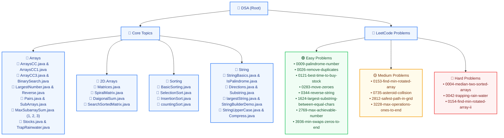

# Data Structures & Algorithms (DSA) in Java, C++ & Python

Welcome to the DSA learning repository. This repository contains implementations of various data structures, sorting and searching algorithms, matrix operations, and solutions to LeetCode coding problems using Java, C++, and Python.

---

## 📂 Repository Structure

The code is organized by topic and LeetCode problem ID under the `DSA` directory:

### Core Topics

| Folder / Topic | Description | Key Source Files |
| :--- | :--- | :--- |
| 📁 **[Arrays](./Arrays)** | Fundamental operations on 1D arrays, search, reverse, subarray sums, and optimization problems. | [ArraysCC.java](./Arrays/ArraysCC.java), [ArraysCC1.java](./Arrays/ArraysCC1.java), [ArrayCC3.java](./Arrays/ArrayCC3.java), [BinarySearch.java](./Arrays/BinarySearch.java), [LargestNumber.java](./Arrays/LargestNumber.java), [Reverse.java](./Arrays/Reverse.java), [Pairs.java](./Arrays/Pairs.java), [SubArrays.java](./Arrays/SubArrays.java), [MaxSubarraySum.java](./Arrays/MaxSubarraySum.java), [maxSubarraySum2.java](./Arrays/maxSubarraySum2.java), [maxSuubarraySum3.java](./Arrays/maxSuubarraySum3.java), [TrapRainwater.java](./Arrays/TrapRainwater.java), [Stocks.java](./Arrays/Stocks.java) |
| 📁 **[2D.Arrays](./2D.Arrays)** | Operations on matrices, diagonal sums, spiral traversals, and search in sorted 2D matrices. | [Matrices.java](./2D.Arrays/Matrices.java), [SpiralMatrix.java](./2D.Arrays/SpiralMatrix.java), [DaigonalSum.java](./2D.Arrays/DaigonalSum.java), [SearchSortedMatrix.java](./2D.Arrays/SearchSortedMatrix.java) |
| 📁 **[Sorting](./Sorting)** | Implementation of classic sorting algorithms. | [BasicSorting.java](./Sorting/BasicSorting.java), [SelectionSort.java](./Sorting/SelectionSort.java), [InsertionSort.java](./Sorting/InsertionSort.java), [countingSort.java](./Sorting/countingSort.java) |
| 📁 **[String](./String)** | String manipulation, basic character iteration, concatenation, directions tracking, palindrome verification, StringBuilder usage, casing conversions, and compression. | [StringBasics.java](./String/StringBasics.java), [IsPalindrome.java](./String/IsPalindrome.java), [Directions.java](./String/Directions.java), [Substring.java](./String/Substring.java), [largestString.java](./String/largestString.java), [StringBuilderDemo.java](./String/StringBuilderDemo.java), [StringUpperCase.java](./String/StringUpperCase.java), [Compress.java](./String/Compress.java) |

### Visual Layout


```mermaid
flowchart TD
    DSA["📁 DSA (Root)"]
    
    %% Core Categories
    DSA --> Core["📁 Core Topics"]
    DSA --> LC["📁 LeetCode Problems"]
    
    %% Core Topics Breakdown
    Core --> Arrays["📁 Arrays<br/>📄 ArraysCC.java & ArraysCC1.java<br/>📄 ArrayCC3.java & BinarySearch.java<br/>📄 LargestNumber.java & Reverse.java<br/>📄 Pairs.java & SubArrays.java<br/>📄 MaxSubarraySum.java (1, 2, 3)<br/>📄 Stocks.java & TrapRainwater.java"]
    Core --> 2DArrays["📁 2D.Arrays<br/>📄 Matrices.java<br/>📄 SpiralMatrix.java<br/>📄 DaigonalSum.java<br/>📄 SearchSortedMatrix.java"]
    Core --> Sorting["📁 Sorting<br/>📄 BasicSorting.java<br/>📄 SelectionSort.java<br/>📄 InsertionSort.java<br/>📄 countingSort.java"]
    Core --> String["📁 String<br/>📄 StringBasics.java & IsPalindrome.java<br/>📄 Directions.java & Substring.java<br/>📄 largestString.java & StringBuilderDemo.java<br/>📄 StringUpperCase.java & Compress.java"]
    
    %% LeetCode Breakdown
    LC --> LCEasy["🟢 Easy Problems<br/>• 0009-palindrome-number<br/>• 0026-remove-duplicates<br/>• 0121-best-time-to-buy-stock<br/>• 0283-move-zeroes<br/>• 0344-reverse-string<br/>• 1624-largest-substring-between-equal-chars<br/>• 2769-max-achievable-number<br/>• 3936-min-swaps-zeros-to-end"]
    LC --> LCMed["🟡 Medium Problems<br/>• 0153-find-min-rotated-array<br/>• 0735-asteroid-collision<br/>• 2812-safest-path-in-grid<br/>• 3228-max-operations-ones-to-end"]
    LC --> LCHard["🔴 Hard Problems<br/>• 0004-median-two-sorted-arrays<br/>• 0042-trapping-rain-water<br/>• 0154-find-min-rotated-array-ii"]

    %% Styling
    classDef folder fill:#eff6ff,stroke:#3b82f6,stroke-width:2px,color:#1e3a8a;
    classDef easy fill:#f0fdf4,stroke:#22c55e,stroke-width:2px,color:#14532d;
    classDef medium fill:#fffbeb,stroke:#f59e0b,stroke-width:2px,color:#78350f;
    classDef hard fill:#fef2f2,stroke:#ef4444,stroke-width:2px,color:#7f1d1d;
    
    class DSA,Core,LC,Arrays,2DArrays,Sorting,String folder;
    class LCEasy easy;
    class LCMed medium;
    class LCHard hard;
```

---

## 📌 Topic Overview

### 1. Arrays & Basics

* **Searching**:
  * Linear Search implementation in [ArrayCC3.java](./Arrays/ArrayCC3.java).
  * Binary Search implementation in [BinarySearch.java](./Arrays/BinarySearch.java).
* **Basics & Manipulation**:
  * Array creation, size, and update: [ArraysCC.java](./Arrays/ArraysCC.java).
  * Array reference passing: [ArraysCC1.java](./Arrays/ArraysCC1.java).
  * Finding the largest & smallest element: [LargestNumber.java](./Arrays/LargestNumber.java).
  * Reverse an array: [Reverse.java](./Arrays/Reverse.java).
* **Subarrays**:
  * Print all pairs: [Pairs.java](./Arrays/Pairs.java).
  * Find all subarrays: [SubArrays.java](./Arrays/SubArrays.java).
  * Subarray Sum (Brute Force): [MaxSubarraySum.java](./Arrays/MaxSubarraySum.java).
  * Subarray Sum (Prefix Sum approach): [maxSubarraySum2.java](./Arrays/maxSubarraySum2.java).
  * Subarray Sum (Kadane's Algorithm - optimized, handles negative numbers): [maxSuubarraySum3.java](./Arrays/maxSuubarraySum3.java).
* **Optimization**:
  * Buy and Sell Stocks: [Stocks.java](./Arrays/Stocks.java).
  * Trapping Rainwater: [TrapRainwater.java](./Arrays/TrapRainwater.java).

### 2. 2D Arrays / Matrices

* **Matrix Creation**: Reading and printing standard matrices in [Matrices.java](./2D.Arrays/Matrices.java).
* **Spiral Matrix**: Clockwise spiral traversal in [SpiralMatrix.java](./2D.Arrays/SpiralMatrix.java).
* **Diagonal Sum**: Calculating primary and secondary diagonal sum in $O(N)$ time complexity in [DaigonalSum.java](./2D.Arrays/DaigonalSum.java).
* **Sorted Matrix Search**: Search in a row-wise and column-wise sorted matrix (Staircase Search) in [SearchSortedMatrix.java](./2D.Arrays/SearchSortedMatrix.java).

### 3. Sorting Algorithms

* **Bubble Sort**: Repeatedly swaps adjacent elements if they are in the wrong order.
* **Selection Sort**: Selects the smallest element from the unsorted portion and puts it at the beginning.
* **Insertion Sort**: Inserts elements into their correct position one by one.
* **Counting Sort**: A non-comparison sorting algorithm that is efficient for sorting items within a specific range.

### 4. Strings

* **String Basics**: Standard operations including iteration, length, and concatenation in [StringBasics.java](./String/StringBasics.java).
* **Palindrome Check**: Checks whether a string reads the same forwards and backwards in [IsPalindrome.java](./String/IsPalindrome.java).
* **Directions tracking**: Finds the shortest displacement path from a series of directions (N, S, E, W) in [Directions.java](./String/Directions.java).
* **Substring extraction**: Custom character slicing and built-in substring handling in [Substring.java](./String/Substring.java).
* **String comparison**: Lexicographical comparison to find the largest string in [largestString.java](./String/largestString.java).
* **StringBuilder demonstration**: Shows efficient string concatenation and characters appending in [StringBuilderDemo.java](./String/StringBuilderDemo.java).
* **First letter capitalization**: Converts the first letter of each word in a string to uppercase in [StringUpperCase.java](./String/StringUpperCase.java).
* **String compression**: Compresses basic strings by counting consecutive duplicate characters in [Compress.java](./String/Compress.java).

---

## 💡 LeetCode Solutions

All solutions are organized under the `LeetCode_Problems/` directory:

| Problem ID | Title | Difficulty | Languages |
| :--- | :--- | :--- | :--- |
| **0004** | [Median of Two Sorted Arrays](./LeetCode_Problems/0004-median-of-two-sorted-arrays) | 🔴 Hard | [Java](./LeetCode_Problems/0004-median-of-two-sorted-arrays/0004-median-of-two-sorted-arrays.java) |
| **0009** | [Palindrome Number](./LeetCode_Problems/0009-palindrome-number) | 🟢 Easy | [Java](./LeetCode_Problems/0009-palindrome-number/0009-palindrome-number.java) |
| **0026** | [Remove Duplicates from Sorted Array](./LeetCode_Problems/0026-remove-duplicates-from-sorted-array) | 🟢 Easy | [Java](./LeetCode_Problems/0026-remove-duplicates-from-sorted-array/0026-remove-duplicates-from-sorted-array.java) |
| **0042** | [Trapping Rain Water](./LeetCode_Problems/0042-trapping-rain-water) | 🔴 Hard | [Java](./LeetCode_Problems/0042-trapping-rain-water/0042-trapping-rain-water.java) |
| **0121** | [Best Time to Buy and Sell Stock](./LeetCode_Problems/0121-best-time-to-buy-and-sell-stock) | 🟢 Easy | [Java](./LeetCode_Problems/0121-best-time-to-buy-and-sell-stock/0121-best-time-to-buy-and-sell-stock.java) |
| **0153** | [Find Minimum in Rotated Sorted Array](./LeetCode_Problems/0153-find-minimum-in-rotated-sorted-array) | 🟡 Medium | [Java](./LeetCode_Problems/0153-find-minimum-in-rotated-sorted-array/0153-find-minimum-in-rotated-sorted-array.java), [C++](./LeetCode_Problems/0153-find-minimum-in-rotated-sorted-array/0153-find-minimum-in-rotated-sorted-array.cpp) |
| **0154** | [Find Minimum in Rotated Sorted Array II](./LeetCode_Problems/0154-find-minimum-in-rotated-sorted-array-ii) | 🔴 Hard | [C++](./LeetCode_Problems/0154-find-minimum-in-rotated-sorted-array-ii/0154-find-minimum-in-rotated-sorted-array-ii.cpp) |
| **0283** | [Move Zeroes](./LeetCode_Problems/0283-move-zeroes) | 🟢 Easy | [Java](./LeetCode_Problems/0283-move-zeroes/0283-move-zeroes.java) |
| **0344** | [Reverse String](./LeetCode_Problems/0344-reverse-string) | 🟢 Easy | [Java](./LeetCode_Problems/0344-reverse-string/0344-reverse-string.java) |
| **0735** | [Asteroid Collision](./LeetCode_Problems/0735-asteroid-collision) | 🟡 Medium | [Java](./LeetCode_Problems/0735-asteroid-collision/0735-asteroid-collision.java) |
| **1624** | [Largest Substring Between Two Equal Characters](./LeetCode_Problems/1624-largest-substring-between-two-equal-characters) | 🟢 Easy | [Java](./LeetCode_Problems/1624-largest-substring-between-two-equal-characters/1624-largest-substring-between-two-equal-characters.java) |
| **2769** | [Find the Maximum Achievable Number](./LeetCode_Problems/2769-find-the-maximum-achievable-number) | 🟢 Easy | [Java](./LeetCode_Problems/2769-find-the-maximum-achievable-number/2769-find-the-maximum-achievable-number.java) |
| **2812** | [Find the Safest Path in a Grid](./LeetCode_Problems/2812-find-the-safest-path-in-a-grid) | 🟡 Medium | [Java](./LeetCode_Problems/2812-find-the-safest-path-in-a-grid/2812-find-the-safest-path-in-a-grid.java) |
| **3228** | [Maximum Number of Operations to Move Ones to the End](./LeetCode_Problems/3228-maximum-number-of-operations-to-move-ones-to-the-end) | 🟡 Medium | [Python](./LeetCode_Problems/3228-maximum-number-of-operations-to-move-ones-to-the-end/3228-maximum-number-of-operations-to-move-ones-to-the-end.py) |
| **3936** | [Minimum Swaps to Move Zeros to End](./LeetCode_Problems/3936-minimum-swaps-to-move-zeros-to-end) | 🟢 Easy | [Java](./LeetCode_Problems/3936-minimum-swaps-to-move-zeros-to-end/3936-minimum-swaps-to-move-zeros-to-end.java) |

---

## 🛠️ How to Compile & Run

### ☕ Java Files

To compile and run any Java file from this repository:

1. Open your terminal and navigate to the directory of the file:

    ```bash
    cd DSA/String
    ```

2. Compile the `.java` file:

    ```bash
    javac IsPalindrome.java
    ```

3. Execute the compiled bytecode:

    ```bash
    java IsPalindrome
    ```

### 💻 C++ Files

To compile and run any C++ file:

1. Open your terminal and navigate to the directory of the file:

    ```bash
    cd DSA/LeetCode_Problems/0153-find-minimum-in-rotated-sorted-array
    ```

2. Compile the `.cpp` file:

    ```bash
    g++ -O3 0153-find-minimum-in-rotated-sorted-array.cpp -o solution
    ```

3. Execute the compiled binary:

    ```bash
    ./solution
    ```

### 🐍 Python Files

To run any Python file:

1. Open your terminal and navigate to the directory of the file:

    ```bash
    cd DSA/LeetCode_Problems/3228-maximum-number-of-operations-to-move-ones-to-the-end
    ```

2. Run the script:

    ```bash
    python 3228-maximum-number-of-operations-to-move-ones-to-the-end.py
    ```
