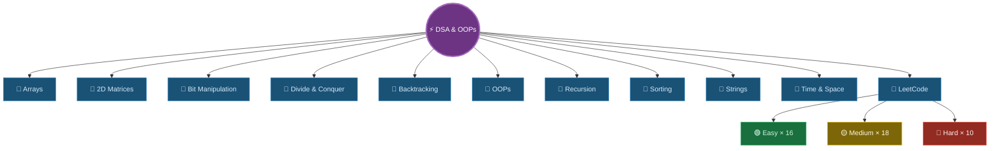

# ⚡ DSA & OOPs — Master Repository

<div align="center">

### *Java · C++ · Python — Data Structures, Algorithms & Object-Oriented Design*

[](https://www.oracle.com/java/)
[](https://isocpp.org/)
[](https://www.python.org/)
[](#-leetcode-solutions-tracker)
[](https://opensource.org/licenses/MIT)

> A curated collection of **117+ production-grade implementations** spanning  
> Data Structures · Algorithm Design · Bit Manipulation · OOP Paradigms · 45 LeetCode Solutions

</div>

---

## 📊 At a Glance

<table>
  <tr>
    <td align="center"><strong>10</strong><br/>Core Modules</td>
    <td align="center"><strong>117+</strong><br/>Code Files</td>
    <td align="center"><strong>45</strong><br/>LeetCode Problems</td>
    <td align="center"><strong>3</strong><br/>Languages</td>
  </tr>
  <tr>
    <td align="center">🟢 16 Easy</td>
    <td align="center">🟡 18 Medium</td>
    <td align="center">🔴 11 Hard</td>
    <td align="center">☕ 💻 🐍</td>
  </tr>
</table>

---

## 📑 Table of Contents

| Section | Description |
| :--- | :--- |
| [📁 Directory Architecture](#-directory-architecture) | Project folder layout |
| [🗺️ Visual Repository Map](#️-visual-repository-map) | Mermaid diagram overview |
| [🧩 Topic Breakdown](#-topic-breakdown--code-catalog) | All 10 modules with file catalogs |
| [💡 LeetCode Tracker](#-leetcode-solutions-tracker) | 44 problems sorted by ID |
| [⏱️ Complexity Reference](#️-complexity-reference-matrix) | Big-O cheat sheet |
| [🛠️ How to Run](#️-how-to-compile--run) | Compile & execute instructions |

---

## 📁 Directory Architecture

```text
DSA/
│
├── 📂 Arrays/                → Linear search, binary search, Kadane's, trapping rainwater
├── 📂 2D.Arrays/             → Spiral traversal, diagonal sum, staircase search
├── 📂 Backracking/           → Array backtracking, subsets, permutations, N-Queens
├── 📂 BitManipulation/       → AND, OR, XOR, shifts, ith-bit ops, power-of-2 checks
├── 📂 DivideNConquer/        → Merge sort, quick sort, search in rotated sorted array
├── 📂 OOPs/                  → Encapsulation, inheritance, abstraction, polymorphism
├── 📂 Recursion/             → Factorials, Fibonacci, occurrence search, tiling,
│                                binary strings, friends pairing, deduplication
├── 📂 Sorting/               → Bubble, selection, insertion, counting sort
├── 📂 String/                → Palindromes, compression, StringBuilder, case conversion
├── 📂 TimeNSpace_Complexity/ → Complexity analysis, optimized algorithms (e.g., modified bubble sort, recursive power)
│
└── 📂 LeetCode_Problems/     → 44 standalone solutions with markdown explanations
    ├── 🟢 16 Easy
    ├── 🟡 18 Medium
    └── 🔴 10 Hard
```

---

## 🗺️ Visual Repository Map


```mermaid
graph TD
    R(("⚡ DSA & OOPs"))

    R --> A["📂 Arrays"]
    R --> M["📂 2D Matrices"]
    R --> B["📂 Bit Manipulation"]
    R --> DC["📂 Divide & Conquer"]
    R --> BK["📂 Backtracking"]
    R --> O["📂 OOPs"]
    R --> REC["📂 Recursion"]
    R --> S["📂 Sorting"]
    R --> ST["📂 Strings"]
    R --> TS["📂 Time & Space"]
    R --> LC["📂 LeetCode"]

    LC --> E["🟢 Easy × 16"]
    LC --> MD["🟡 Medium × 18"]
    LC --> H["🔴 Hard × 10"]

    style R fill:#6c3483,stroke:#a569bd,stroke-width:3px,color:#fff
    style A fill:#1a5276,stroke:#2e86c1,color:#d6eaf8
    style M fill:#1a5276,stroke:#2e86c1,color:#d6eaf8
    style B fill:#1a5276,stroke:#2e86c1,color:#d6eaf8
    style DC fill:#1a5276,stroke:#2e86c1,color:#d6eaf8
    style BK fill:#1a5276,stroke:#2e86c1,color:#d6eaf8
    style O fill:#1a5276,stroke:#2e86c1,color:#d6eaf8
    style REC fill:#1a5276,stroke:#2e86c1,color:#d6eaf8
    style S fill:#1a5276,stroke:#2e86c1,color:#d6eaf8
    style ST fill:#1a5276,stroke:#2e86c1,color:#d6eaf8
    style TS fill:#1a5276,stroke:#2e86c1,color:#d6eaf8
    style LC fill:#1a5276,stroke:#2e86c1,color:#d6eaf8
    style E fill:#196f3d,stroke:#27ae60,color:#d5f5e3
    style MD fill:#7d6608,stroke:#f1c40f,color:#fef9e7
    style H fill:#922b21,stroke:#e74c3c,color:#fdedec
```

---

## 🧩 Topic Breakdown & Code Catalog

### 1 · Arrays & Algorithmic Patterns

> 13 files — Linear search through Kadane's algorithm to trapping rainwater

| File | Concept | Time | Space |
| :--- | :--- | :---: | :---: |
| [`ArraysCC.java`](./Arrays/ArraysCC.java) | Array Basics — declaration, allocation, updates | $O(1)$ | $O(N)$ |
| [`ArraysCC1.java`](./Arrays/ArraysCC1.java) | Memory References — pass-by-reference semantics | $O(1)$ | $O(1)$ |
| [`ArrayCC3.java`](./Arrays/ArrayCC3.java) | Linear Search — sequential scan | $O(N)$ | $O(1)$ |
| [`BinarySearch.java`](./Arrays/BinarySearch.java) | Binary Search — interval halving on sorted data | $O(\log N)$ | $O(1)$ |
| [`LargestNumber.java`](./Arrays/LargestNumber.java) | Min / Max — single-pass extrema extraction | $O(N)$ | $O(1)$ |
| [`Reverse.java`](./Arrays/Reverse.java) | Reversal — dual-pointer in-place swap | $O(N)$ | $O(1)$ |
| [`Pairs.java`](./Arrays/Pairs.java) | Pairing — all distinct $(A_i, A_j)$ generation | $O(N^2)$ | $O(1)$ |
| [`SubArrays.java`](./Arrays/SubArrays.java) | Subarrays — contiguous subsegment enumeration | $O(N^3)$ | $O(1)$ |
| [`MaxSubarraySum.java`](./Arrays/MaxSubarraySum.java) | Brute Force Sum — cubic max subarray | $O(N^3)$ | $O(1)$ |
| [`maxSubarraySum2.java`](./Arrays/maxSubarraySum2.java) | Prefix Sum — quadratic with precomputed sums | $O(N^2)$ | $O(N)$ |
| [`maxSuubarraySum3.java`](./Arrays/maxSuubarraySum3.java) | Kadane's Algorithm — optimal linear DP | $O(N)$ | $O(1)$ |
| [`Stocks.java`](./Arrays/Stocks.java) | Buy & Sell Stock — min-price tracking | $O(N)$ | $O(1)$ |
| [`TrapRainwater.java`](./Arrays/TrapRainwater.java) | Trapping Rainwater — boundary elevation vectors | $O(N)$ | $O(N)$ |

---

### 2 · 2D Matrices & Multi-Axis Search

> 4 files — Spiral traversal, diagonal sums, staircase search

| File | Concept | Time | Space |
| :--- | :--- | :---: | :---: |
| [`Matrices.java`](./2D.Arrays/Matrices.java) | Matrix Fundamentals — row-column iteration | $O(N \times M)$ | $O(N \times M)$ |
| [`SpiralMatrix.java`](./2D.Arrays/SpiralMatrix.java) | Spiral Traversal — clockwise layer peeling | $O(N \times M)$ | $O(1)$ |
| [`DaigonalSum.java`](./2D.Arrays/DaigonalSum.java) | Diagonal Sum — primary + secondary with overlap check | $O(N)$ | $O(1)$ |
| [`SearchSortedMatrix.java`](./2D.Arrays/SearchSortedMatrix.java) | Staircase Search — corner-pivot elimination | $O(N + M)$ | $O(1)$ |

---

### 3 · Bitwise Manipulation & Binary Arithmetic

> 14 files — Every core bit operation from AND to range clears

| File | Operation | Formula / Rule |
| :--- | :--- | :--- |
| [`BinaryAND.java`](./BitManipulation/BinaryAND.java) | AND (`&`) | 1 only if both bits are 1 |
| [`BinaryOR.java`](./BitManipulation/BinaryOR.java) | OR (`\|`) | 1 if at least one bit is 1 |
| [`BinaryXOR.java`](./BitManipulation/BinaryXOR.java) | XOR (`^`) | 1 if bits differ |
| [`BinaryNOT.java`](./BitManipulation/BinaryNOT.java) | NOT (`~`) | Inverts all bits |
| [`BInaryLeft.java`](./BitManipulation/BInaryLeft.java) | Left Shift (`<<`) | $a \ll b = a \times 2^b$ |
| [`BinaryRight.java`](./BitManipulation/BinaryRight.java) | Right Shift (`>>`) | $a \gg b = \lfloor a / 2^b \rfloor$ |
| [`OddorEven.java`](./BitManipulation/OddorEven.java) | Parity Check | `(n & 1) == 0` → Even |
| [`getIthbit.java`](./BitManipulation/getIthbit.java) | Read $i$-th Bit | `(n & (1 << i)) != 0` |
| [`setIthBit.java`](./BitManipulation/setIthBit.java) | Set $i$-th Bit | `n \| (1 << i)` |
| [`clearIthBit.java`](./BitManipulation/clearIthBit.java) | Clear $i$-th Bit | `n & ~(1 << i)` |
| [`updateIthBit.java`](./BitManipulation/updateIthBit.java) | Update $i$-th Bit | Clear then `newBit << i` |
| [`clearLastIthBit.java`](./BitManipulation/clearLastIthBit.java) | Clear $i$ LSBs | `n & (~0 << i)` |
| [`clearRange.java`](./BitManipulation/clearRange.java) | Clear Range $[i, j]$ | Mask: `(~0 << (j+1))` \| `((1 << i) - 1)` |
| [`CheckPower.java`](./BitManipulation/CheckPower.java) | Power of 2 | `(n & (n-1)) == 0` |

---

### 4 · Object-Oriented Programming (OOPs)

> 12 files — Four pillars of OOP with Java implementation patterns

| File | Pillar / Keyword | Description |
| :--- | :--- | :--- |
| [`Abstraction.java`](./OOPs/OOPs/Abstraction.java) | Abstraction | Abstract classes, methods, constructor chaining |
| [`ClassesAndObjects.java`](./OOPs/OOPs/ClassesAndObjects.java) | Classes & Objects | Fields, methods, instantiation |
| [`GettersAndSetters.java`](./OOPs/OOPs/GettersAndSetters.java) | Encapsulation | Private data with public accessors/mutators |
| [`Constructors.java`](./OOPs/OOPs/Constructors.java) | Constructors | Parameterized overloading |
| [`CopyConstructor.java`](./OOPs/OOPs/CopyConstructor.java) | Object Cloning | Shallow vs deep copy |
| [`Inheritance.java`](./OOPs/OOPs/Inheritance.java) | Inheritance | `extends` and code reusability |
| [`HybridInheritance.java`](./OOPs/OOPs/HybridInheritance.java) | Hybrid Hierarchies | Multi-level + hierarchical combos |
| [`Interface.java`](./OOPs/OOPs/Interface.java) | Interfaces | `interface` & `implements` contracts |
| [`Polymorphism.java`](./OOPs/OOPs/Polymorphism.java) | Polymorphism | Overloading (compile) & overriding (runtime) |
| [`Modifiers.java`](./OOPs/OOPs/Modifiers.java) | Access Modifiers | `public`, `private`, `protected`, default |
| [`Satic.java`](./OOPs/OOPs/Satic.java) | Static Keyword | Class-level fields, methods, blocks |
| [`Super.java`](./OOPs/OOPs/Super.java) | Super Keyword | `super()` and parent method calls |

---

### 5 · Sorting Algorithms

> 4 files — Comparison & non-comparison sorting with stability analysis

| File | Algorithm | Best | Avg | Worst | Space | Stable? |
| :--- | :--- | :---: | :---: | :---: | :---: | :---: |
| [`BasicSorting.java`](./Sorting/BasicSorting.java) | Bubble Sort | $O(N)$ | $O(N^2)$ | $O(N^2)$ | $O(1)$ | ✅ |
| [`SelectionSort.java`](./Sorting/SelectionSort.java) | Selection Sort | $O(N^2)$ | $O(N^2)$ | $O(N^2)$ | $O(1)$ | ❌ |
| [`InsertionSort.java`](./Sorting/InsertionSort.java) | Insertion Sort | $O(N)$ | $O(N^2)$ | $O(N^2)$ | $O(1)$ | ✅ |
| [`countingSort.java`](./Sorting/countingSort.java) | Counting Sort | $O(N+K)$ | $O(N+K)$ | $O(N+K)$ | $O(K)$ | ✅ |

---

### 6 · String Manipulation & Processing

> 8 files — Immutability, palindromes, compression, and case formatting

| File | Concept | Time |
| :--- | :--- | :---: |
| [`StringBasics.java`](./String/StringBasics.java) | Immutability, `.length()`, `.charAt()` | $O(N)$ |
| [`IsPalindrome.java`](./String/IsPalindrome.java) | Two-pointer palindrome check | $O(N)$ |
| [`Directions.java`](./String/Directions.java) | Displacement vector $\sqrt{x^2 + y^2}$ | $O(N)$ |
| [`Substring.java`](./String/Substring.java) | Range extraction vs `.substring()` | $O(K)$ |
| [`largestString.java`](./String/largestString.java) | Lexicographic max via `.compareTo()` | $O(N \times L)$ |
| [`StringBuilderDemo.java`](./String/StringBuilderDemo.java) | Mutable buffer append operations | $O(N)$ |
| [`StringUpperCase.java`](./String/StringUpperCase.java) | Title case — first char uppercase per word | $O(N)$ |
| [`Compress.java`](./String/Compress.java) | Run-length encoding (`"aaabbc"` → `"a3b2c1"`) | $O(N)$ |

---

### 7 · Recursion & Call Stack Foundations

> 12 files — From basic print recursion to friends pairing & binary strings

| File | Problem | Recurrence | Time | Space |
| :--- | :--- | :--- | :---: | :---: |
| [`DecreasingOrder.java`](./Recursion/DecreasingOrder.java) | Decreasing Print | $P(N) = N \to P(N{-}1)$ | $O(N)$ | $O(N)$ |
| [`IncreasingOrder.java`](./Recursion/IncreasingOrder.java) | Increasing Print | $P(N) = P(N{-}1) \to N$ | $O(N)$ | $O(N)$ |
| [`Printfactorial.java`](./Recursion/Printfactorial.java) | Factorial $N!$ | $F(N) = N \cdot F(N{-}1)$ | $O(N)$ | $O(N)$ |
| [`NaturalNoSum.java`](./Recursion/NaturalNoSum.java) | Sum of $N$ | $S(N) = N + S(N{-}1)$ | $O(N)$ | $O(N)$ |
| [`Fibbonacci.java`](./Recursion/Fibbonacci.java) | Fibonacci | $Fib(N) = Fib(N{-}1) + Fib(N{-}2)$ | $O(2^N)$ | $O(N)$ |
| [`CheckSortedarray.java`](./Recursion/CheckSortedarray.java) | Sorted Check | $Sorted(i) = A[i] \le A[i{+}1] \land Sorted(i{+}1)$ | $O(N)$ | $O(N)$ |
| [`FirstOccurence.java`](./Recursion/FirstOccurence.java) | First Occurrence | Forward scan — return index on match | $O(N)$ | $O(N)$ |
| [`LastOccurrence.java`](./Recursion/LastOccurrence.java) | Last Occurrence | Forward recursion, backward match eval | $O(N)$ | $O(N)$ |
| [`Tilling.java`](./Recursion/Tilling.java) | 2×N Floor Tiling | $T(N) = T(N{-}1) + T(N{-}2)$ | $O(2^N)$ | $O(N)$ |
| [`BinaryString.java`](./Recursion/BinaryString.java) | Binary Strings (no consecutive 1s) | Branch: place 0 always, place 1 only after 0 | $O(2^N)$ | $O(N)$ |
| [`FriendsPairing.java`](./Recursion/FriendsPairing.java) | Friends Pairing | $F(N) = F(N{-}1) + (N{-}1) \cdot F(N{-}2)$ | $O(2^N)$ | $O(N)$ |
| [`RemoveDuplicatesInString.java`](./Recursion/RemoveDuplicatesInString.java) | Remove Duplicate Chars | Boolean map + recursive char append | $O(N)$ | $O(N)$ |

---

### 8 · Divide & Conquer Algorithms

> 3 files — Recursive divide-and-conquer sorting and search techniques

| File | Concept | Time | Space |
| :--- | :--- | :---: | :---: |
| [`MergeSort.java`](./DivideNConquer/MergeSort.java) | Merge Sort — divide, conquer, and merge recursion | $O(N \log N)$ | $O(N)$ |
| [`QuickSort.java`](./DivideNConquer/QuickSort.java) | Quick Sort — pivot-based partitioning (in-place) | $O(N \log N)$ avg / $O(N^2)$ worst | $O(\log N)$ |
| [`RotatedSortedArray.java`](./DivideNConquer/RotatedSortedArray.java) | Search in Rotated Sorted Array — pivot binary search | $O(\log N)$ | $O(\log N)$ |

---

### 9 · Time & Space Complexity Analysis

> 4 files — Complexity optimization, early-exit strategies, and recursive exponentiation analysis

| File | Concept | Time | Space |
| :--- | :--- | :---: | :---: |
| [`modifiedBubbleSort.java`](./TimeNSpace_Complexity/modifiedBubbleSort.java) | Modified Bubble Sort — optimized with early exit when sorted | $O(N)$ best / $O(N^2)$ worst | $O(1)$ |
| [`PowerFun.java`](./TimeNSpace_Complexity/PowerFun.java) | Linear Power — simple recursive exponentiation $a^n = a \cdot a^{n-1}$ | $O(n)$ | $O(n)$ |
| [`Power2.java`](./TimeNSpace_Complexity/Power2.java) | Naive Divide-and-Conquer Power — unoptimized recursion (no caching) | $O(n)$ | $O(\log n)$ |
| [`PowerFun3.java`](./TimeNSpace_Complexity/PowerFun3.java) | Optimized Divide-and-Conquer Power — logarithmic exponentiation with caching | $O(\log n)$ | $O(\log n)$ |

---

### 10 · Backtracking Algorithms

> 9 files — State restoration, recursive permutations, subset generation, grid paths, sudoku solving, and chessboard constraints

| File | Concept | Time | Space |
| :--- | :--- | :---: | :---: |
| [`chnangeArr.java`](./Backracking/chnangeArr.java) | Array Backtracking — updating elements and reverting on recursion return | $O(N)$ | $O(N)$ |
| [`FindSubset.java`](./Backracking/FindSubset.java) | Subsets Generator — recursive choice tree of element inclusion/exclusion | $O(2^N)$ | $O(N)$ |
| [`FindPermtn.java`](./Backracking/FindPermtn.java) | Permutation Generator — full string arrangement via iterative backtracking | $O(N \cdot N!)$ | $O(N)$ |
| [`GridWays.java`](./Backracking/GridWays.java) | Grid Ways — backtracking to count paths in a 2D matrix | $O(2^{N+M})$ | $O(N+M)$ |
| [`NQueens.java`](./Backracking/NQueens.java) | N-Queens Solver — safe chessboard queen placements with backtracking | $O(N!)$ | $O(N)$ |
| [`NQueens1soln.java`](./Backracking/NQueens1soln.java) | N-Queens Single Solution — existence check and single board state | $O(N!)$ | $O(N)$ |
| [`nQueens2.java`](./Backracking/nQueens2.java) | N-Queens All Solutions — explores and prints all valid board configurations | $O(N!)$ | $O(N)$ |
| [`Soduku.java`](./Backracking/Soduku.java) | Sudoku Solver — cell placement validation with backtracking | $O(9^{N \times N})$ | $O(N^2)$ |
| [`waysToSolveN_queens.java`](./Backracking/waysToSolveN_queens.java) | N-Queens Ways Count — combinatorial backtracking to count total solutions | $O(N!)$ | $O(N)$ |

---

## 💡 LeetCode Solutions Tracker

### 🟢 Easy — 16 Problems

| # | Problem | Category | Solution |
| :---: | :--- | :--- | :---: |
| 0009 | [Palindrome Number](./LeetCode_Problems/0009-palindrome-number) | Math | [Java](./LeetCode_Problems/0009-palindrome-number/0009-palindrome-number.java) |
| 0026 | [Remove Duplicates from Sorted Array](./LeetCode_Problems/0026-remove-duplicates-from-sorted-array) | Two Pointers | [Java](./LeetCode_Problems/0026-remove-duplicates-from-sorted-array/0026-remove-duplicates-from-sorted-array.java) |
| 0028 | [Find Index of First Occurrence in String](./LeetCode_Problems/0028-find-the-index-of-the-first-occurrence-in-a-string) | String Matching | [Java](./LeetCode_Problems/0028-find-the-index-of-the-first-occurrence-in-a-string/0028-find-the-index-of-the-first-occurrence-in-a-string.java) |
| 0088 | [Merge Sorted Array](./LeetCode_Problems/0088-merge-sorted-array) | Two Pointers | [Java](./LeetCode_Problems/0088-merge-sorted-array/0088-merge-sorted-array.java) |
| 0121 | [Best Time to Buy and Sell Stock](./LeetCode_Problems/0121-best-time-to-buy-and-sell-stock) | DP / Single Pass | [Java](./LeetCode_Problems/0121-best-time-to-buy-and-sell-stock/0121-best-time-to-buy-and-sell-stock.java) |
| 0190 | [Reverse Bits](./LeetCode_Problems/0190-reverse-bits) | Bit Manipulation | [Java](./LeetCode_Problems/0190-reverse-bits/0190-reverse-bits.java) |
| 0283 | [Move Zeroes](./LeetCode_Problems/0283-move-zeroes) | Two Pointers | [Java](./LeetCode_Problems/0283-move-zeroes/0283-move-zeroes.java) |
| 0344 | [Reverse String](./LeetCode_Problems/0344-reverse-string) | Two Pointers | [Java](./LeetCode_Problems/0344-reverse-string/0344-reverse-string.java) |
| 0509 | [Fibonacci Number](./LeetCode_Problems/0509-fibonacci-number) | Math / DP | [Java](./LeetCode_Problems/0509-fibonacci-number/0509-fibonacci-number.java) |
| 1464 | [Max Product of Two Elements](./LeetCode_Problems/1464-maximum-product-of-two-elements-in-an-array) | Greedy | [Java](./LeetCode_Problems/1464-maximum-product-of-two-elements-in-an-array/1464-maximum-product-of-two-elements-in-an-array.java) |
| 1624 | [Largest Substring Between Equal Chars](./LeetCode_Problems/1624-largest-substring-between-two-equal-characters) | Hash Table | [Java](./LeetCode_Problems/1624-largest-substring-between-two-equal-characters/1624-largest-substring-between-two-equal-characters.java) |
| 2769 | [Find Maximum Achievable Number](./LeetCode_Problems/2769-find-the-maximum-achievable-number) | Math | [Java](./LeetCode_Problems/2769-find-the-maximum-achievable-number/2769-find-the-maximum-achievable-number.java) |
| 3014 | [Min Pushes to Type Word I](./LeetCode_Problems/3014-minimum-number-of-pushes-to-type-word-i) | Greedy | [Java](./LeetCode_Problems/3014-minimum-number-of-pushes-to-type-word-i/3014-minimum-number-of-pushes-to-type-word-i.java) |
| 3345 | [Smallest Divisible Digit Product I](./LeetCode_Problems/3345-smallest-divisible-digit-product-i) | Math | [Java](./LeetCode_Problems/3345-smallest-divisible-digit-product-i/3345-smallest-divisible-digit-product-i.java) |
| 3731 | [Find Missing Elements](./LeetCode_Problems/3731-find-missing-elements) | Hash Set | [Java](./LeetCode_Problems/3731-find-missing-elements/3731-find-missing-elements.java) |
| 3936 | [Min Swaps to Move Zeros to End](./LeetCode_Problems/3936-minimum-swaps-to-move-zeros-to-end) | Greedy | [Java](./LeetCode_Problems/3936-minimum-swaps-to-move-zeros-to-end/3936-minimum-swaps-to-move-zeros-to-end.java) |

### 🟡 Medium — 18 Problems

| # | Problem | Category | Solution |
| :---: | :--- | :--- | :---: |
| 0078 | [Subsets](./LeetCode_Problems/0078-subsets) | Backtracking | [Java](./LeetCode_Problems/0078-subsets/0078-subsets.java) |
| 0090 | [Subsets II](./LeetCode_Problems/0090-subsets-ii) | Backtracking | [Java](./LeetCode_Problems/0090-subsets-ii/0090-subsets-ii.java) |
| 0153 | [Find Min in Rotated Sorted Array](./LeetCode_Problems/0153-find-minimum-in-rotated-sorted-array) | Binary Search | [Java](./LeetCode_Problems/0153-find-minimum-in-rotated-sorted-array/0153-find-minimum-in-rotated-sorted-array.java) · [C++](./LeetCode_Problems/0153-find-minimum-in-rotated-sorted-array/0153-find-minimum-in-rotated-sorted-array.cpp) |
| 0201 | [Bitwise AND of Numbers Range](./LeetCode_Problems/0201-bitwise-and-of-numbers-range) | Bit Manipulation | [Java](./LeetCode_Problems/0201-bitwise-and-of-numbers-range/0201-bitwise-and-of-numbers-range.java) |
| 0238 | [Product of Array Except Self](./LeetCode_Problems/0238-product-of-array-except-self) | Prefix / Suffix | [Java](./LeetCode_Problems/0238-product-of-array-except-self/0238-product-of-array-except-self.java) |
| 0371 | [Sum of Two Integers](./LeetCode_Problems/0371-sum-of-two-integers) | Bit Manipulation | [Java](./LeetCode_Problems/0371-sum-of-two-integers/0371-sum-of-two-integers.java) |
| 0486 | [Predict the Winner](./LeetCode_Problems/0486-predict-the-winner) | DP / Minimax | [Java](./LeetCode_Problems/0486-predict-the-winner/0486-predict-the-winner.java) |
| 0567 | [Permutation in String](./LeetCode_Problems/0567-permutation-in-string) | Sliding Window | [Java](./LeetCode_Problems/0567-permutation-in-string/0567-permutation-in-string.java) |
| 0735 | [Asteroid Collision](./LeetCode_Problems/0735-asteroid-collision) | Stack | [Java](./LeetCode_Problems/0735-asteroid-collision/0735-asteroid-collision.java) |
| 0877 | [Stone Game](./LeetCode_Problems/0877-stone-game) | Game Theory / DP | [Java](./LeetCode_Problems/0877-stone-game/0877-stone-game.java) |
| 1222 | [Queens That Can Attack the King](./LeetCode_Problems/1222-queens-that-can-attack-the-king) | Matrix / Simulation | [Java](./LeetCode_Problems/1222-queens-that-can-attack-the-king/1222-queens-that-can-attack-the-king.java) |
| 2812 | [Find Safest Path in a Grid](./LeetCode_Problems/2812-find-the-safest-path-in-a-grid) | BFS / Binary Search | [Java](./LeetCode_Problems/2812-find-the-safest-path-in-a-grid/2812-find-the-safest-path-in-a-grid.java) |
| 3016 | [Min Pushes to Type Word II](./LeetCode_Problems/3016-minimum-number-of-pushes-to-type-word-ii) | Greedy / Sorting | [Java](./LeetCode_Problems/3016-minimum-number-of-pushes-to-type-word-ii/3016-minimum-number-of-pushes-to-type-word-ii.java) |
| 3159 | [Find Occurrences of Element in Array](./LeetCode_Problems/3159-find-occurrences-of-an-element-in-an-array) | Array / Hash Map | [Java](./LeetCode_Problems/3159-find-occurrences-of-an-element-in-an-array/3159-find-occurrences-of-an-element-in-an-array.java) |
| 3228 | [Max Ops to Move Ones to End](./LeetCode_Problems/3228-maximum-number-of-operations-to-move-ones-to-the-end) | Greedy / String | [Python](./LeetCode_Problems/3228-maximum-number-of-operations-to-move-ones-to-the-end/3228-maximum-number-of-operations-to-move-ones-to-the-end.py) |
| 3302 | [Lexicographically Smallest Valid Seq](./LeetCode_Problems/3302-find-the-lexicographically-smallest-valid-sequence) | Two Pointers / DP | [Java](./LeetCode_Problems/3302-find-the-lexicographically-smallest-valid-sequence/3302-find-the-lexicographically-smallest-valid-sequence.java) |
| 3310 | [Remove Methods From Project](./LeetCode_Problems/3310-remove-methods-from-project) | Graph (BFS/DFS) | [Java](./LeetCode_Problems/3310-remove-methods-from-project/3310-remove-methods-from-project.java) |
| 3517 | [Smallest Palindromic Rearrangement I](./LeetCode_Problems/3517-smallest-palindromic-rearrangement-i) | Greedy / Sorting | [Java](./LeetCode_Problems/3517-smallest-palindromic-rearrangement-i/3517-smallest-palindromic-rearrangement-i.java) |

### 🔴 Hard — 11 Problems

| # | Problem | Category | Solution |
| :---: | :--- | :--- | :---: |
| 0004 | [Median of Two Sorted Arrays](./LeetCode_Problems/0004-median-of-two-sorted-arrays) | Binary Search / D&C | [Java](./LeetCode_Problems/0004-median-of-two-sorted-arrays/0004-median-of-two-sorted-arrays.java) |
| 0037 | [Sudoku Solver](./LeetCode_Problems/0037-sudoku-solver) | Backtracking | [Java](./LeetCode_Problems/0037-sudoku-solver/0037-sudoku-solver.java) |
| 0042 | [Trapping Rain Water](./LeetCode_Problems/0042-trapping-rain-water) | Two Pointers / DP | [Java](./LeetCode_Problems/0042-trapping-rain-water/0042-trapping-rain-water.java) |
| 0051 | [N-Queens](./LeetCode_Problems/0051-n-queens) | Backtracking | [Java](./LeetCode_Problems/0051-n-queens/0051-n-queens.java) |
| 0052 | [N-Queens II](./LeetCode_Problems/0052-n-queens-ii) | Backtracking | [Java](./LeetCode_Problems/0052-n-queens-ii/0052-n-queens-ii.java) |
| 0154 | [Find Min in Rotated Sorted Array II](./LeetCode_Problems/0154-find-minimum-in-rotated-sorted-array-ii) | Binary Search | [C++](./LeetCode_Problems/0154-find-minimum-in-rotated-sorted-array-ii/0154-find-minimum-in-rotated-sorted-array-ii.cpp) |
| 1406 | [Stone Game III](./LeetCode_Problems/1406-stone-game-iii) | Minimax DP | [Java](./LeetCode_Problems/1406-stone-game-iii/1406-stone-game-iii.java) |
| 1510 | [Stone Game IV](./LeetCode_Problems/1510-stone-game-iv) | DP / Game Theory | [Java](./LeetCode_Problems/1510-stone-game-iv/1510-stone-game-iv.java) |
| 3348 | [Smallest Divisible Digit Product II](./LeetCode_Problems/3348-smallest-divisible-digit-product-ii) | Greedy / Math | [Java](./LeetCode_Problems/3348-smallest-divisible-digit-product-ii/3348-smallest-divisible-digit-product-ii.java) |
| 3518 | [Smallest Palindromic Rearrangement II](./LeetCode_Problems/3518-smallest-palindromic-rearrangement-ii) | DP / Combinatorics | [Java](./LeetCode_Problems/3518-smallest-palindromic-rearrangement-ii/3518-smallest-palindromic-rearrangement-ii.java) |
| 3962 | [Max Subarray Sum After K Swaps](./LeetCode_Problems/3962-maximum-subarray-sum-after-at-most-k-swaps) | DP / Prefix Sums | [Java](./LeetCode_Problems/3962-maximum-subarray-sum-after-at-most-k-swaps/3962-maximum-subarray-sum-after-at-most-k-swaps.java) |

---

## ⏱️ Complexity Reference Matrix

| Algorithm | Best | Average | Worst | Space | Notes |
| :--- | :---: | :---: | :---: | :---: | :--- |
| Linear Search | $O(1)$ | $O(N)$ | $O(N)$ | $O(1)$ | Unsorted data |
| Binary Search | $O(1)$ | $O(\log N)$ | $O(\log N)$ | $O(1)$ | Requires sorted input |
| Search in Rotated Array | $O(1)$ | $O(\log N)$ | $O(\log N)$ | $O(\log N)$ | Modified binary search |
| Staircase Search | $O(1)$ | $O(N{+}M)$ | $O(N{+}M)$ | $O(1)$ | Row + column sorted matrix |
| Kadane's Algorithm | $O(N)$ | $O(N)$ | $O(N)$ | $O(1)$ | Max subarray (DP) |
| Prefix Sum | $O(N)$ | $O(N^2)$ | $O(N^2)$ | $O(N)$ | $O(1)$ range queries |
| Bubble Sort | $O(N)$ | $O(N^2)$ | $O(N^2)$ | $O(1)$ | Stable |
| Selection Sort | $O(N^2)$ | $O(N^2)$ | $O(N^2)$ | $O(1)$ | Unstable |
| Insertion Sort | $O(N)$ | $O(N^2)$ | $O(N^2)$ | $O(1)$ | Online, stable |
| Merge Sort | $O(N \log N)$ | $O(N \log N)$ | $O(N \log N)$ | $O(N)$ | Stable, divide-and-conquer |
| Quick Sort | $O(N \log N)$ | $O(N \log N)$ | $O(N^2)$ | $O(\log N)$ | Unstable, in-place partitioning |
| Counting Sort | $O(N{+}K)$ | $O(N{+}K)$ | $O(N{+}K)$ | $O(K)$ | Non-comparison |
| Linear Recursion | $O(1)$ | $O(N)$ | $O(N)$ | $O(N)$ | Stack depth = $N$ |
| Tree Recursion | $O(2^N)$ | $O(2^N)$ | $O(2^N)$ | $O(N)$ | Fibonacci / Tiling / Pairing |
| Linear Exponentiation ($a^n$) | $O(n)$ | $O(n)$ | $O(n)$ | $O(n)$ | Simple linear recursion stack |
| Logarithmic Exponentiation ($a^n$) | $O(\log n)$ | $O(\log n)$ | $O(\log n)$ | $O(\log n)$ | Optimized divide-and-conquer with caching |
| Subsets Generation | $O(2^N)$ | $O(2^N)$ | $O(2^N)$ | $O(N)$ | Backtracking decision tree (include/exclude) |
| Permutations Generation | $O(N!)$ | $O(N \cdot N!)$ | $O(N \cdot N!)$ | $O(N)$ | Backtracking character placement |
| N-Queens Solver | $O(N!)$ | $O(N!)$ | $O(N!)$ | $O(N)$ | Chess board backtracking placement |

---

## 🛠️ How to Compile & Run

### ☕ Java

```bash
cd DSA/Recursion
javac BinaryString.java
java Recursion.BinaryString
```

### 💻 C++

```bash
cd DSA/LeetCode_Problems/0153-find-minimum-in-rotated-sorted-array
g++ -O3 0153-find-minimum-in-rotated-sorted-array.cpp -o solution
./solution
```

### 🐍 Python

```bash
cd DSA/LeetCode_Problems/3228-maximum-number-of-operations-to-move-ones-to-the-end
python 3228-maximum-number-of-operations-to-move-ones-to-the-end.py
```

---

<div align="center">

*Crafted with precision for computer science foundations & competitive programming.*

</div>
