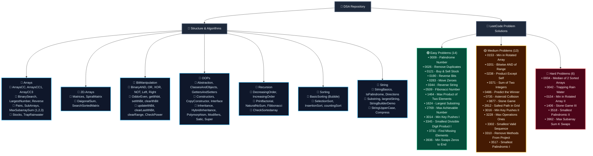

# 🚀 Data Structures & Algorithms (DSA) & OOPs in Java, C++ & Python

[](https://www.oracle.com/java/)
[](https://isocpp.org/)
[](https://www.python.org/)
[](#-leetcode-solutions-tracker)
[](https://opensource.org/licenses/MIT)

Welcome to the **Data Structures & Algorithms (DSA) and Object-Oriented Programming (OOPs)** repository. This collection contains clean, optimized, and well-structured implementations of foundational computer science concepts, core algorithm design patterns, bitwise operations, OOP paradigms, recursion, sorting, string manipulation, and **33 curated problem solutions** from LeetCode across **Java**, **C++**, and **Python**.

---

## 📑 Table of Contents

- [🚀 Data Structures \& Algorithms (DSA) \& OOPs in Java, C++ \& Python](#-data-structures--algorithms-dsa--oops-in-java-c--python)
  - [📑 Table of Contents](#-table-of-contents)
  - [📁 Directory Structure](#-directory-structure)
  - [🧩 Core Topics \& Modules](#-core-topics--modules)
    - [1. Arrays \& Algorithmic Patterns](#1-arrays--algorithmic-patterns)
    - [2. 2D Arrays / Matrix Operations](#2-2d-arrays--matrix-operations)
    - [3. Bit Manipulation \& Binary Operations](#3-bit-manipulation--binary-operations)
    - [4. Object-Oriented Programming (OOPs)](#4-object-oriented-programming-oops)
    - [5. Sorting Algorithms](#5-sorting-algorithms)
    - [6. String Manipulation \& Utilities](#6-string-manipulation--utilities)
    - [7. Recursion \& Call Stack Foundations](#7-recursion--call-stack-foundations)
  - [📊 Visual Architecture](#-visual-architecture)
  - [💡 LeetCode Solutions Tracker](#-leetcode-solutions-tracker)
  - [⏱️ Complexity Reference Table](#️-complexity-reference-table)
  - [🛠️ How to Compile \& Run](#️-how-to-compile--run)
    - [☕ Java Execution](#-java-execution)
    - [💻 C++ Execution](#-c-execution)
    - [🐍 Python Execution](#-python-execution)
  - [🤝 Contributing](#-contributing)

---

## 📁 Directory Structure

```text
DSA/
├── Arrays/               # 1D Array algorithms, searching, subarray sums & optimizations
├── 2D.Arrays/            # Matrix operations, diagonal sum, spiral traversal & matrix search
├── BitManipulation/      # Bitwise operators, bit masking, ith-bit operations & bit tricks
├── OOPs/                 # Classes, inheritance, abstraction, constructors, static & super keywords
├── Recursion/            # Recursive functions, base cases, factorial, Fibonacci, array sorted check & natural sums
├── Sorting/              # Classic sorting algorithms (Bubble, Selection, Insertion, Counting)
├── String/               # String manipulation, palindrome check, compression & StringBuilder
└── LeetCode_Problems/    # 33 Curated LeetCode problem solutions (Java, C++, Python)
```

---

## 🧩 Core Topics & Modules

### 1. Arrays & Algorithmic Patterns

Fundamental linear data structure operations, search techniques, subarray analysis, and algorithmic optimization patterns.

| File | Topic / Concept | Description | Time Complexity | Space Complexity |
| :--- | :--- | :--- | :--- | :--- |
| [`ArraysCC.java`](./Arrays/ArraysCC.java) | Array Basics | Creation, length initialization, and basic element updating. | $O(1)$ | $O(N)$ |
| [`ArraysCC1.java`](./Arrays/ArraysCC1.java) | Pass by Reference | Demonstrates array reference passing in Java methods. | $O(1)$ | $O(1)$ |
| [`ArrayCC3.java`](./Arrays/ArrayCC3.java) | Linear Search | Iterative searching through array elements. | $O(N)$ | $O(1)$ |
| [`BinarySearch.java`](./Arrays/BinarySearch.java) | Binary Search | Divide-and-conquer searching on sorted arrays. | $O(\log N)$ | $O(1)$ |
| [`LargestNumber.java`](./Arrays/LargestNumber.java) | Extreme Values | Single-pass search for maximum & minimum elements. | $O(N)$ | $O(1)$ |
| [`Reverse.java`](./Arrays/Reverse.java) | Array Reversal | In-place double-pointer array swapping. | $O(N)$ | $O(1)$ |
| [`Pairs.java`](./Arrays/Pairs.java) | Array Pairings | Generating all distinct pairs of array elements. | $O(N^2)$ | $O(1)$ |
| [`SubArrays.java`](./Arrays/SubArrays.java) | Subarray Generation | Printing all contiguous subsegments of an array. | $O(N^3)$ | $O(1)$ |
| [`MaxSubarraySum.java`](./Arrays/MaxSubarraySum.java) | Max Subarray Sum | Brute force check of all subarray sums. | $O(N^3)$ | $O(1)$ |
| [`maxSubarraySum2.java`](./Arrays/maxSubarraySum2.java) | Max Subarray Sum | Optimized sum calculation using Prefix Sum array. | $O(N^2)$ | $O(N)$ |
| [`maxSuubarraySum3.java`](./Arrays/maxSuubarraySum3.java) | Kadane's Algorithm | Optimal single-pass dynamic programming approach. | $O(N)$ | $O(1)$ |
| [`Stocks.java`](./Arrays/Stocks.java) | Buy & Sell Stock | Single-pass max profit calculation under price trends. | $O(N)$ | $O(1)$ |
| [`TrapRainwater.java`](./Arrays/TrapRainwater.java) | Trapping Rainwater | Two-pointer elevation bounds calculation for trapped water. | $O(N)$ | $O(N)$ |

---

### 2. 2D Arrays / Matrix Operations

Multi-dimensional array structures, directional matrix traversals, and multi-axis search algorithms.

| File | Topic / Concept | Description | Time Complexity | Space Complexity |
| :--- | :--- | :--- | :--- | :--- |
| [`Matrices.java`](./2D.Arrays/Matrices.java) | Matrix I/O | Standard creation, row-column iteration, and min/max lookup. | $O(N \times M)$ | $O(N \times M)$ |
| [`SpiralMatrix.java`](./2D.Arrays/SpiralMatrix.java) | Spiral Order Traversal | Clockwise layer-by-layer matrix boundary traversal. | $O(N \times M)$ | $O(1)$ |
| [`DaigonalSum.java`](./2D.Arrays/DaigonalSum.java) | Diagonal Sum | Single-pass $O(N)$ calculation of primary & secondary diagonals. | $O(N)$ | $O(1)$ |
| [`SearchSortedMatrix.java`](./2D.Arrays/SearchSortedMatrix.java) | Staircase Search | $O(N + M)$ search starting from top-right corner in sorted matrix. | $O(N + M)$ | $O(1)$ |

---

### 3. Bit Manipulation & Binary Operations

Low-level bitwise manipulation, mask generation, binary bit testing, and arithmetic tricks using binary operators.

| File | Topic / Concept | Description |
| :--- | :--- | :--- |
| [`BinaryAND.java`](./BitManipulation/BinaryAND.java) | Bitwise AND (`&`) | Computes bitwise conjunction of two numbers. |
| [`BinaryOR.java`](./BitManipulation/BinaryOR.java) | Bitwise OR (`\|`) | Computes bitwise disjunction of two numbers. |
| [`BinaryXOR.java`](./BitManipulation/BinaryXOR.java) | Bitwise XOR (`^`) | Computes exclusive OR between numbers. |
| [`BinaryNOT.java`](./BitManipulation/BinaryNOT.java) | Bitwise NOT (`~`) | Computes 1's complement flip of bits. |
| [`BInaryLeft.java`](./BitManipulation/BInaryLeft.java) | Left Shift (`<<`) | Shifts bits left (multiplication by $2^k$). |
| [`BinaryRight.java`](./BitManipulation/BinaryRight.java) | Right Shift (`>>`) | Shifts bits right (division by $2^k$). |
| [`OddorEven.java`](./BitManipulation/OddorEven.java) | Parity Check | Checks if least significant bit (LSB) is set (`n & 1`). |
| [`getIthbit.java`](./BitManipulation/getIthbit.java) | Get $i$-th Bit | Extracts bit at index $i$ using mask `(1 << i)`. |
| [`setIthBit.java`](./BitManipulation/setIthBit.java) | Set $i$-th Bit | Turns bit at index $i$ to 1 using `n \| (1 << i)`. |
| [`clearIthBit.java`](./BitManipulation/clearIthBit.java) | Clear $i$-th Bit | Turns bit at index $i$ to 0 using `n & ~(1 << i)`. |
| [`updateIthBit.java`](./BitManipulation/updateIthBit.java) | Update $i$-th Bit | Updates $i$-th bit to specified value (0 or 1). |
| [`clearLastIthBit.java`](./BitManipulation/clearLastIthBit.java) | Clear $i$ LSBs | Clears rightmost $i$ bits using bitmask `(~0 << i)`. |
| [`clearRange.java`](./BitManipulation/clearRange.java) | Clear Bit Range | Clears range of bits between indices $i$ and $j$. |
| [`CheckPower.java`](./BitManipulation/CheckPower.java) | Power of 2 Check | Evaluates if $n$ is power of 2 using property `(n & (n - 1)) == 0`. |

---

### 4. Object-Oriented Programming (OOPs)

Object-oriented design principles in Java demonstrating encapsulation, abstraction, inheritance, constructors, access modifiers, polymorphism, static scope, and super constructor calls.

| File | Topic / Concept | Description |
| :--- | :--- | :--- |
| [`Abstraction.java`](./OOPs/OOPs/Abstraction.java) | Abstraction & Abstract Classes | Abstract classes, abstract methods, dynamic method overriding, and constructor chaining. |
| [`ClassesAndObjects.java`](./OOPs/OOPs/ClassesAndObjects.java) | Classes & Instantiation | Defining object attributes, behaviors, and instantiation syntax. |
| [`GettersAndSetters.java`](./OOPs/OOPs/GettersAndSetters.java) | Encapsulation | Encapsulating private fields with controlled public accessors/mutators. |
| [`Constructors.java`](./OOPs/OOPs/Constructors.java) | Constructors | Parameterized and non-parameterized object initialization. |
| [`CopyConstructor.java`](./OOPs/OOPs/CopyConstructor.java) | Shallow vs. Deep Copy | Object cloning using copy constructors (shallow vs. deep copy). |
| [`Inheritance.java`](./OOPs/OOPs/Inheritance.java) | Class Inheritance | Parent-child class hierarchies (`extends` keyword) and reusability. |
| [`HybridInheritance.java`](./OOPs/OOPs/HybridInheritance.java) | Hybrid Inheritance | Combining hierarchical and multi-level inheritance hierarchies. |
| [`Interface.java`](./OOPs/OOPs/Interface.java) | Interfaces & Pure Abstraction | Contracts using `interface` & `implements` (Chess pieces: Queen, Rook, Pawn). |
| [`Polymorphism.java`](./OOPs/OOPs/Polymorphism.java) | Polymorphism & Overriding | Method overloading & dynamic method dispatch with `@Override`. |
| [`Modifiers.java`](./OOPs/OOPs/Modifiers.java) | Access Control | Demonstrating `public`, `private`, `protected`, and default visibility. |
| [`Satic.java`](./OOPs/OOPs/Satic.java) | Static Keyword | Class-level static fields shared across instances and static nested classes. |
| [`Super.java`](./OOPs/OOPs/Super.java) | Super Keyword | Invoking superclass constructors (`super()`) and superclass method inheritance. |

---

### 5. Sorting Algorithms

Implementations of standard comparison-based and non-comparison sorting routines.

| File | Algorithm | Description | Best Time | Avg Time | Worst Time | Space |
| :--- | :--- | :--- | :--- | :--- | :--- | :--- |
| [`BasicSorting.java`](./Sorting/BasicSorting.java) | **Bubble Sort** | Repeated adjacent element swapping. | $O(N)$ | $O(N^2)$ | $O(N^2)$ | $O(1)$ |
| [`SelectionSort.java`](./Sorting/SelectionSort.java) | **Selection Sort** | Unsorted minimum element selection & place. | $O(N^2)$ | $O(N^2)$ | $O(N^2)$ | $O(1)$ |
| [`InsertionSort.java`](./Sorting/InsertionSort.java) | **Insertion Sort** | Progressive element insertion into sorted slice. | $O(N)$ | $O(N^2)$ | $O(N^2)$ | $O(1)$ |
| [`countingSort.java`](./Sorting/countingSort.java) | **Counting Sort** | Non-comparison frequency distribution sorting. | $O(N + K)$ | $O(N + K)$ | $O(N + K)$ | $O(K)$ |

---

### 6. String Manipulation & Utilities

String processing, immutable string handling, sequence verification, and memory-efficient `StringBuilder` usage.

| File | Topic / Concept | Description | Time Complexity |
| :--- | :--- | :--- | :--- |
| [`StringBasics.java`](./String/StringBasics.java) | String Fundamentals | Length calculation, character access, and string concatenation. | $O(N)$ |
| [`IsPalindrome.java`](./String/IsPalindrome.java) | Palindrome Verification | Two-pointer matching from start and end. | $O(N)$ |
| [`Directions.java`](./String/Directions.java) | Shortest Path / Geometry | Calculates displacement vector length from (N, S, E, W) path. | $O(N)$ |
| [`Substring.java`](./String/Substring.java) | Substring Slicing | Custom character range extraction and built-in `.substring()`. | $O(K)$ |
| [`largestString.java`](./String/largestString.java) | Lexicographical Compare | Finds largest string alphabetically using `.compareTo()`. | $O(N \times L)$ |
| [`StringBuilderDemo.java`](./String/StringBuilderDemo.java) | `StringBuilder` | Mutable character sequence construction without object churn. | $O(N)$ |
| [`StringUpperCase.java`](./String/StringUpperCase.java) | Title Casing | Converts first letter of every word in sentence to uppercase. | $O(N)$ |
| [`Compress.java`](./String/Compress.java) | String Compression | Run-length encoding of consecutive duplicate characters. | $O(N)$ |

---

### 7. Recursion & Call Stack Foundations

Fundamental principles of recursion, defining base conditions, stack frame execution, subproblem division, and recurrence calculations.

| File | Concept / Problem | Description | Time Complexity | Space Complexity |
| :--- | :--- | :--- | :--- | :--- |
| [`DecreasingOrder.java`](./Recursion/DecreasingOrder.java) | Decreasing Print | Prints numbers from $N$ down to 1 using tail-call recursion stack. | $O(N)$ | $O(N)$ |
| [`IncreasingOrder.java`](./Recursion/IncreasingOrder.java) | Increasing Print | Prints numbers from 1 up to $N$ using post-call stack unwinding. | $O(N)$ | $O(N)$ |
| [`Printfactorial.java`](./Recursion/Printfactorial.java) | Factorial ($N!$) | Computes factorial via subproblem recurrence $F(N) = N \times F(N-1)$. | $O(N)$ | $O(N)$ |
| [`NaturalNoSum.java`](./Recursion/NaturalNoSum.java) | Sum of $N$ Natural Numbers | Computes sum of first $N$ integers via $S(N) = N + S(N-1)$. | $O(N)$ | $O(N)$ |
| [`Fibbonacci.java`](./Recursion/Fibbonacci.java) | $N$-th Fibonacci Number | Computes $N$-th Fibonacci number via tree recursion $Fib(N) = Fib(N-1) + Fib(N-2)$. | $O(2^N)$ | $O(N)$ |
| [`CheckSortedarray.java`](./Recursion/CheckSortedarray.java) | Array Sorted Check | Evaluates whether array elements are sorted in non-decreasing order using recursion. | $O(N)$ | $O(N)$ |

---

## 📊 Visual Architecture


```mermaid
flowchart TD
    DSA["📁 DSA Repository"]
    
    %% Categories
    DSA --> Core["📁 Structure & Algorithms"]
    DSA --> LC["📁 LeetCode Problem Solutions"]
    
    %% DSA Breakdown
    Core --> Arrays["📁 Arrays<br/>📄 ArraysCC, ArraysCC1, ArrayCC3<br/>📄 BinarySearch, LargestNumber, Reverse<br/>📄 Pairs, SubArrays, MaxSubarraySum (1,2,3)<br/>📄 Stocks, TrapRainwater"]
    Core --> 2DArrays["📁 2D.Arrays<br/>📄 Matrices, SpiralMatrix<br/>📄 DaigonalSum, SearchSortedMatrix"]
    Core --> Bitwise["📁 BitManipulation<br/>📄 BinaryAND, OR, XOR, NOT, Left, Right<br/>📄 OddorEven, getIthbit, setIthBit, clearIthBit<br/>📄 updateIthBit, clearLastIthBit, clearRange, CheckPower"]
    Core --> OOPs["📁 OOPs<br/>📄 Abstraction, ClassesAndObjects, GettersAndSetters<br/>📄 Constructors, CopyConstructor, Interface<br/>📄 Inheritance, HybridInheritance, Polymorphism, Modifiers, Satic, Super"]
    Core --> Recursion["📁 Recursion<br/>📄 DecreasingOrder, IncreasingOrder<br/>📄 Printfactorial, NaturalNoSum, Fibbonacci<br/>📄 CheckSortedarray"]
    Core --> Sorting["📁 Sorting<br/>📄 BasicSorting (Bubble)<br/>📄 SelectionSort, InsertionSort, countingSort"]
    Core --> String["📁 String<br/>📄 StringBasics, IsPalindrome, Directions<br/>📄 Substring, largestString, StringBuilderDemo<br/>📄 StringUpperCase, Compress"]
    
    %% LeetCode Breakdown
    LC --> Easy["🟢 Easy Problems (14)<br/>• 0009 - Palindrome Number<br/>• 0026 - Remove Duplicates<br/>• 0121 - Buy & Sell Stock<br/>• 0190 - Reverse Bits<br/>• 0283 - Move Zeroes<br/>• 0344 - Reverse String<br/>• 0509 - Fibonacci Number<br/>• 1464 - Max Product of Two Elements<br/>• 1624 - Largest Substring<br/>• 2769 - Max Achievable Number<br/>• 3014 - Min Key Pushes I<br/>• 3345 - Smallest Divisible Digit Product I<br/>• 3731 - Find Missing Elements<br/>• 3936 - Min Swaps Zeros to End"]
    LC --> Medium["🟡 Medium Problems (13)<br/>• 0153 - Min in Rotated Array<br/>• 0201 - Bitwise AND of Range<br/>• 0238 - Product Except Self<br/>• 0371 - Sum of Two Integers<br/>• 0486 - Predict the Winner<br/>• 0735 - Asteroid Collision<br/>• 0877 - Stone Game<br/>• 2812 - Safest Path in Grid<br/>• 3016 - Min Key Pushes II<br/>• 3228 - Max Operations Ones<br/>• 3302 - Smallest Valid Sequence<br/>• 3310 - Remove Methods From Project<br/>• 3517 - Smallest Palindromic I"]
    LC --> Hard["🔴 Hard Problems (6)<br/>• 0004 - Median of 2 Sorted Arrays<br/>• 0042 - Trapping Rain Water<br/>• 0154 - Min in Rotated Array II<br/>• 1406 - Stone Game III<br/>• 3518 - Smallest Palindromic II<br/>• 3962 - Max Subarray Sum K Swaps"]

    %% Styling
    classDef main fill:#1e293b,stroke:#64748b,stroke-width:2px,color:#f8fafc;
    classDef folder fill:#0f172a,stroke:#38bdf8,stroke-width:2px,color:#e0f2fe;
    classDef easy fill:#064e3b,stroke:#34d399,stroke-width:2px,color:#ecfdf5;
    classDef medium fill:#451a03,stroke:#fbbf24,stroke-width:2px,color:#fffbeb;
    classDef hard fill:#4c0519,stroke:#f87171,stroke-width:2px,color:#fef2f2;
    
    class DSA,Core,LC main;
    class Arrays,2DArrays,Bitwise,OOPs,Recursion,Sorting,String folder;
    class Easy easy;
    class Medium medium;
    class Hard hard;
```

---

## 💡 LeetCode Solutions Tracker

Comprehensive index of 33 solved LeetCode challenges sorted by problem ID:

| ID | Problem Title | Difficulty | Topic / Category | Solutions Available |
| :---: | :--- | :---: | :--- | :--- |
| **0004** | [Median of Two Sorted Arrays](./LeetCode_Problems/0004-median-of-two-sorted-arrays) | 🔴 Hard | Arrays / Binary Search | [Java](./LeetCode_Problems/0004-median-of-two-sorted-arrays/0004-median-of-two-sorted-arrays.java) |
| **0009** | [Palindrome Number](./LeetCode_Problems/0009-palindrome-number) | 🟢 Easy | Math / Logic | [Java](./LeetCode_Problems/0009-palindrome-number/0009-palindrome-number.java) |
| **0026** | [Remove Duplicates from Sorted Array](./LeetCode_Problems/0026-remove-duplicates-from-sorted-array) | 🟢 Easy | Two Pointers / Arrays | [Java](./LeetCode_Problems/0026-remove-duplicates-from-sorted-array/0026-remove-duplicates-from-sorted-array.java) |
| **0042** | [Trapping Rain Water](./LeetCode_Problems/0042-trapping-rain-water) | 🔴 Hard | Two Pointers / Dynamic Programming | [Java](./LeetCode_Problems/0042-trapping-rain-water/0042-trapping-rain-water.java) |
| **0121** | [Best Time to Buy and Sell Stock](./LeetCode_Problems/0121-best-time-to-buy-and-sell-stock) | 🟢 Easy | Dynamic Programming / Sliding Window | [Java](./LeetCode_Problems/0121-best-time-to-buy-and-sell-stock/0121-best-time-to-buy-and-sell-stock.java) |
| **0153** | [Find Minimum in Rotated Sorted Array](./LeetCode_Problems/0153-find-minimum-in-rotated-sorted-array) | 🟡 Medium | Binary Search | [Java](./LeetCode_Problems/0153-find-minimum-in-rotated-sorted-array/0153-find-minimum-in-rotated-sorted-array.java), [C++](./LeetCode_Problems/0153-find-minimum-in-rotated-sorted-array/0153-find-minimum-in-rotated-sorted-array.cpp) |
| **0154** | [Find Minimum in Rotated Sorted Array II](./LeetCode_Problems/0154-find-minimum-in-rotated-sorted-array-ii) | 🔴 Hard | Binary Search / Duplicates | [C++](./LeetCode_Problems/0154-find-minimum-in-rotated-sorted-array-ii/0154-find-minimum-in-rotated-sorted-array-ii.cpp) |
| **0190** | [Reverse Bits](./LeetCode_Problems/0190-reverse-bits) | 🟢 Easy | Bit Manipulation | [Java](./LeetCode_Problems/0190-reverse-bits/0190-reverse-bits.java) |
| **0201** | [Bitwise AND of Numbers Range](./LeetCode_Problems/0201-bitwise-and-of-numbers-range) | 🟡 Medium | Bit Manipulation | [Java](./LeetCode_Problems/0201-bitwise-and-of-numbers-range/0201-bitwise-and-of-numbers-range.java) |
| **0238** | [Product of Array Except Self](./LeetCode_Problems/0238-product-of-array-except-self) | 🟡 Medium | Prefix / Suffix Products | [Java](./LeetCode_Problems/0238-product-of-array-except-self/0238-product-of-array-except-self.java) |
| **0283** | [Move Zeroes](./LeetCode_Problems/0283-move-zeroes) | 🟢 Easy | Two Pointers | [Java](./LeetCode_Problems/0283-move-zeroes/0283-move-zeroes.java) |
| **0344** | [Reverse String](./LeetCode_Problems/0344-reverse-string) | 🟢 Easy | Two Pointers / Strings | [Java](./LeetCode_Problems/0344-reverse-string/0344-reverse-string.java) |
| **0371** | [Sum of Two Integers](./LeetCode_Problems/0371-sum-of-two-integers) | 🟡 Medium | Bit Manipulation / Logic | [Java](./LeetCode_Problems/0371-sum-of-two-integers/0371-sum-of-two-integers.java) |
| **0486** | [Predict the Winner](./LeetCode_Problems/0486-predict-the-winner) | 🟡 Medium | Dynamic Programming / Recursion / Game Theory | [Java](./LeetCode_Problems/0486-predict-the-winner/0486-predict-the-winner.java) |
| **0509** | [Fibonacci Number](./LeetCode_Problems/0509-fibonacci-number) | 🟢 Easy | Math / Dynamic Programming / Recursion | [Java](./LeetCode_Problems/0509-fibonacci-number/0509-fibonacci-number.java) |
| **0735** | [Asteroid Collision](./LeetCode_Problems/0735-asteroid-collision) | 🟡 Medium | Stack / Simulation | [Java](./LeetCode_Problems/0735-asteroid-collision/0735-asteroid-collision.java) |
| **0877** | [Stone Game](./LeetCode_Problems/0877-stone-game) | 🟡 Medium | Math / Dynamic Programming / Game Theory | [Java](./LeetCode_Problems/0877-stone-game/0877-stone-game.java) |
| **1406** | [Stone Game III](./LeetCode_Problems/1406-stone-game-iii) | 🔴 Hard | Dynamic Programming / Game Theory | [Java](./LeetCode_Problems/1406-stone-game-iii/1406-stone-game-iii.java) |
| **1464** | [Max Product of Two Elements in Array](./LeetCode_Problems/1464-maximum-product-of-two-elements-in-an-array) | 🟢 Easy | Arrays / Sorting | [Java](./LeetCode_Problems/1464-maximum-product-of-two-elements-in-an-array/1464-maximum-product-of-two-elements-in-an-array.java) |
| **1624** | [Largest Substring Between Equal Chars](./LeetCode_Problems/1624-largest-substring-between-two-equal-characters) | 🟢 Easy | Hash Table / String | [Java](./LeetCode_Problems/1624-largest-substring-between-two-equal-characters/1624-largest-substring-between-two-equal-characters.java) |
| **2769** | [Find Maximum Achievable Number](./LeetCode_Problems/2769-find-the-maximum-achievable-number) | 🟢 Easy | Math | [Java](./LeetCode_Problems/2769-find-the-maximum-achievable-number/2769-find-the-maximum-achievable-number.java) |
| **2812** | [Find the Safest Path in a Grid](./LeetCode_Problems/2812-find-the-safest-path-in-a-grid) | 🟡 Medium | BFS / Dijkstra / Matrix | [Java](./LeetCode_Problems/2812-find-the-safest-path-in-a-grid/2812-find-the-safest-path-in-a-grid.java) |
| **3014** | [Minimum Number of Pushes to Type Word I](./LeetCode_Problems/3014-minimum-number-of-pushes-to-type-word-i) | 🟢 Easy | Greedy / Math | [Java](./LeetCode_Problems/3014-minimum-number-of-pushes-to-type-word-i/3014-minimum-number-of-pushes-to-type-word-i.java) |
| **3016** | [Minimum Number of Pushes to Type Word II](./LeetCode_Problems/3016-minimum-number-of-pushes-to-type-word-ii) | 🟡 Medium | Greedy / Sorting / Frequency | [Java](./LeetCode_Problems/3016-minimum-number-of-pushes-to-type-word-ii/3016-minimum-number-of-pushes-to-type-word-ii.java) |
| **3228** | [Max Operations to Move Ones to End](./LeetCode_Problems/3228-maximum-number-of-operations-to-move-ones-to-the-end) | 🟡 Medium | Greedy / String | [Python](./LeetCode_Problems/3228-maximum-number-of-operations-to-move-ones-to-the-end/3228-maximum-number-of-operations-to-move-ones-to-the-end.py) |
| **3302** | [Find the Lexicographically Smallest Valid Sequence](./LeetCode_Problems/3302-find-the-lexicographically-smallest-valid-sequence) | 🟡 Medium | Two Pointers / Dynamic Programming | [Java](./LeetCode_Problems/3302-find-the-lexicographically-smallest-valid-sequence/3302-find-the-lexicographically-smallest-valid-sequence.java) |
| **3310** | [Remove Methods From Project](./LeetCode_Problems/3310-remove-methods-from-project) | 🟡 Medium | Graph / BFS / DFS | [Java](./LeetCode_Problems/3310-remove-methods-from-project/3310-remove-methods-from-project.java) |
| **3345** | [Smallest Divisible Digit Product I](./LeetCode_Problems/3345-smallest-divisible-digit-product-i) | 🟢 Easy | Math / Enumeration | [Java](./LeetCode_Problems/3345-smallest-divisible-digit-product-i/3345-smallest-divisible-digit-product-i.java) |
| **3517** | [Smallest Palindromic Rearrangement I](./LeetCode_Problems/3517-smallest-palindromic-rearrangement-i) | 🟡 Medium | Greedy / String / Palindrome | [Java](./LeetCode_Problems/3517-smallest-palindromic-rearrangement-i/3517-smallest-palindromic-rearrangement-i.java) |
| **3518** | [Smallest Palindromic Rearrangement II](./LeetCode_Problems/3518-smallest-palindromic-rearrangement-ii) | 🔴 Hard | Dynamic Programming / Combinatorics | [Java](./LeetCode_Problems/3518-smallest-palindromic-rearrangement-ii/3518-smallest-palindromic-rearrangement-ii.java) |
| **3731** | [Find Missing Elements](./LeetCode_Problems/3731-find-missing-elements) | 🟢 Easy | Arrays / Hash Table / Math | [Java](./LeetCode_Problems/3731-find-missing-elements/3731-find-missing-elements.java) |
| **3936** | [Minimum Swaps to Move Zeros to End](./LeetCode_Problems/3936-minimum-swaps-to-move-zeros-to-end) | 🟢 Easy | Arrays / Greedy | [Java](./LeetCode_Problems/3936-minimum-swaps-to-move-zeros-to-end/3936-minimum-swaps-to-move-zeros-to-end.java) |
| **3962** | [Maximum Subarray Sum After at Most K Swaps](./LeetCode_Problems/3962-maximum-subarray-sum-after-at-most-k-swaps) | 🔴 Hard | Arrays / Dynamic Programming / Prefix Sum | [Java](./LeetCode_Problems/3962-maximum-subarray-sum-after-at-most-k-swaps/3962-maximum-subarray-sum-after-at-most-k-swaps.java) |

---

## ⏱️ Complexity Reference Table

| Pattern / Algorithm | Best Time | Average Time | Worst Time | Space | Notes |
| :--- | :---: | :---: | :---: | :---: | :--- |
| **Linear Search** | $O(1)$ | $O(N)$ | $O(N)$ | $O(1)$ | Works on unsorted arrays |
| **Binary Search** | $O(1)$ | $O(\log N)$ | $O(\log N)$ | $O(1)$ | Requires sorted array |
| **Staircase Matrix Search** | $O(1)$ | $O(N+M)$ | $O(N+M)$ | $O(1)$ | Row-wise & col-wise sorted matrix |
| **Kadane's Algorithm** | $O(N)$ | $O(N)$ | $O(N)$ | $O(1)$ | Handles negative numbers |
| **Prefix Sum Subarray** | $O(N)$ | $O(N^2)$ | $O(N^2)$ | $O(N)$ | Pre-computes prefix sums |
| **Bubble Sort** | $O(N)$ | $O(N^2)$ | $O(N^2)$ | $O(1)$ | Stable sorting |
| **Selection Sort** | $O(N^2)$ | $O(N^2)$ | $O(N^2)$ | $O(1)$ | Unstable sorting |
| **Insertion Sort** | $O(N)$ | $O(N^2)$ | $O(N^2)$ | $O(1)$ | Efficient for small/nearly sorted data |
| **Counting Sort** | $O(N+K)$ | $O(N+K)$ | $O(N+K)$ | $O(K)$ | Non-comparison sort |
| **Recursive Print** | $O(N)$ | $O(N)$ | $O(N)$ | $O(N)$ | Linear call stack depth $N$ |
| **Factorial Recursion** | $O(N)$ | $O(N)$ | $O(N)$ | $O(N)$ | Subproblem recurrence $F(N) = N \times F(N-1)$ |
| **Fibonacci Recursion** | $O(2^N)$ | $O(2^N)$ | $O(2^N)$ | $O(N)$ | Tree recursion branching factor 2 |
| **Array Sorted Check (Recursion)** | $O(1)$ | $O(N)$ | $O(N)$ | $O(N)$ | Linear call stack depth $N$ |

---

## 🛠️ How to Compile & Run

### ☕ Java Execution

1. Navigate to the relevant module directory:

   ```bash
   cd DSA/Recursion
   ```

2. Compile the target `.java` file:

   ```bash
   javac CheckSortedarray.java
   ```

3. Execute the bytecode:

   ```bash
   java Recursion.CheckSortedarray
   ```

### 💻 C++ Execution

1. Navigate to the target C++ solution directory:

   ```bash
   cd DSA/LeetCode_Problems/0153-find-minimum-in-rotated-sorted-array
   ```

2. Compile using standard `g++`:

   ```bash
   g++ -O3 0153-find-minimum-in-rotated-sorted-array.cpp -o solution
   ```

3. Run the binary executable:

   ```bash
   ./solution
   ```

### 🐍 Python Execution

1. Navigate to the target Python solution directory:

   ```bash
   cd DSA/LeetCode_Problems/3228-maximum-number-of-operations-to-move-ones-to-the-end
   ```

2. Run the script:

   ```bash
   python 3228-maximum-number-of-operations-to-move-ones-to-the-end.py
   ```

---

## 🤝 Contributing

Contributions, problem additions, and optimizations are welcome!

1. Fork the repository.
2. Create a new topic branch (`git checkout -b feature/new-solution`).
3. Commit your changes with clear messages (`git commit -m 'Add LeetCode problem solution'`).
4. Push to your branch and open a Pull Request.

---
*Maintained with ❤️ for clean code & continuous learning.*
