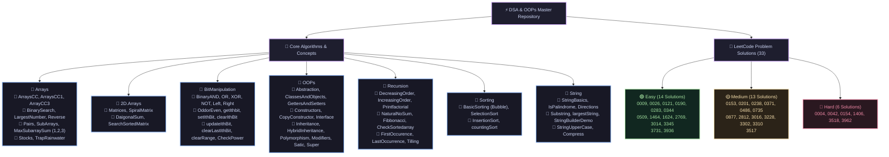

# ⚡ Data Structures, Algorithms & OOPs

<div align="center">

### *Comprehensive Master Repository in Java, C++ & Python*

[](https://www.oracle.com/java/)
[](https://isocpp.org/)
[](https://www.python.org/)
[](#-leetcode-solutions-tracker)
[](https://opensource.org/licenses/MIT)

---

<p align="center">
  A curated collection of production-grade implementations covering <b>Data Structures</b>, <b>Algorithm Design Patterns</b>, <b>Bit Manipulation</b>, <b>Object-Oriented Programming Paradigms</b>, and <b>33 LeetCode Problem Solutions</b>.
</p>

</div>

---

## 📊 Repository Dashboard

| 🚀 Metric | 📈 Details |
| :--- | :--- |
| **Primary Languages** | `Java ☕` • `C++ 💻` • `Python 🐍` |
| **Core DSA Categories** | 7 Modules *(Arrays, 2D Matrices, Bitwise, OOPs, Recursion, Sorting, Strings)* |
| **LeetCode Solved** | **33 Problems** *(14 🟢 Easy \| 13 🟡 Medium \| 6 🔴 Hard)* |
| **Total Implementations** | **90+ Production Code Files** |

---

## 📑 Quick Navigation

- [📁 Directory Architecture](#-directory-architecture)
- [🧩 Topic Breakdown & Code Catalog](#-topic-breakdown--code-catalog)
  - [1. Arrays & Algorithmic Patterns](#1-arrays--algorithmic-patterns)
  - [2. 2D Matrices & Multi-Axis Search](#2-2d-matrices--multi-axis-search)
  - [3. Bitwise Manipulation & Binary Arithmetic](#3-bitwise-manipulation--binary-arithmetic)
  - [4. Object-Oriented Programming (OOPs)](#4-object-oriented-programming-oops)
  - [5. Sorting Algorithms](#5-sorting-algorithms)
  - [6. String Manipulation & Processing](#6-string-manipulation--processing)
  - [7. Recursion & Call Stack Foundations](#7-recursion--call-stack-foundations)
- [📊 Visual Repository Map](#-visual-repository-map)
- [💡 LeetCode Solutions Tracker](#-leetcode-solutions-tracker)
- [⏱️ Complexity Reference Matrix](#️-complexity-reference-matrix)
- [🛠️ How to Compile & Run](#️-how-to-compile--run)

---

## 📁 Directory Architecture

```text
DSA/
├── 📁 Arrays/               # Linear search, binary search, subarray sums, Kadane's & trapping rainwater
├── 📁 2D.Arrays/            # Spiral matrix traversal, diagonal sum & staircase matrix searching
├── 📁 BitManipulation/      # Bit masking, ith-bit operations, bit flips & power checks
├── 📁 OOPs/                 # Encapsulation, inheritance, abstraction, polymorphism & static keywords
├── 📁 Recursion/            # Call stacks, Fibonacci, factorials, first/last occurrence, tiling & sorted checks
├── 📁 Sorting/              # Bubble, selection, insertion & counting sort routines
├── 📁 String/               # String immutability, StringBuilder, palindrome check & run-length compression
└── 📁 LeetCode_Problems/    # 33 Solution modules with standalone code & Markdown explanations
```

---

## 🧩 Topic Breakdown & Code Catalog

### 1. Arrays & Algorithmic Patterns

| Source File | Concept | Algorithmic Highlight | Time | Space |
| :--- | :--- | :--- | :---: | :---: |
| [`ArraysCC.java`](./Arrays/ArraysCC.java) | Array Basics | Array declaration, memory allocation, element updates | $O(1)$ | $O(N)$ |
| [`ArraysCC1.java`](./Arrays/ArraysCC1.java) | Memory References | Pass-by-reference semantics in Java array method calls | $O(1)$ | $O(1)$ |
| [`ArrayCC3.java`](./Arrays/ArrayCC3.java) | Linear Search | Sequential index evaluation across unsorted elements | $O(N)$ | $O(1)$ |
| [`BinarySearch.java`](./Arrays/BinarySearch.java) | Binary Search | Logarithmic interval halving on sorted arrays | $O(\log N)$ | $O(1)$ |
| [`LargestNumber.java`](./Arrays/LargestNumber.java) | Extremity Search | Single-pass min/max element extraction | $O(N)$ | $O(1)$ |
| [`Reverse.java`](./Arrays/Reverse.java) | Array Reversal | In-place dual-pointer swapping mechanism | $O(N)$ | $O(1)$ |
| [`Pairs.java`](./Arrays/Pairs.java) | Element Pairing | Generation of all distinct unordered pairs $(A_i, A_j)$ | $O(N^2)$ | $O(1)$ |
| [`SubArrays.java`](./Arrays/SubArrays.java) | Subarrays | Enumeration of contiguous array subsegments | $O(N^3)$ | $O(1)$ |
| [`MaxSubarraySum.java`](./Arrays/MaxSubarraySum.java) | Brute Force Sum | Cubic complexity maximum subarray calculation | $O(N^3)$ | $O(1)$ |
| [`maxSubarraySum2.java`](./Arrays/maxSubarraySum2.java) | Prefix Sum | Quadratic subarray evaluation via precomputed cumulative sum | $O(N^2)$ | $O(N)$ |
| [`maxSuubarraySum3.java`](./Arrays/maxSuubarraySum3.java) | Kadane's Algorithm | Optimal linear dynamic programming maximum subarray sum | $O(N)$ | $O(1)$ |
| [`Stocks.java`](./Arrays/Stocks.java) | Buy & Sell Stock | Single-pass track of minimum price & maximum profit | $O(N)$ | $O(1)$ |
| [`TrapRainwater.java`](./Arrays/TrapRainwater.java) | Trapping Rainwater | Auxiliary max boundary elevation vectors for trapped water | $O(N)$ | $O(N)$ |

---

### 2. 2D Matrices & Multi-Axis Search

| Source File | Concept | Algorithmic Highlight | Time | Space |
| :--- | :--- | :--- | :---: | :---: |
| [`Matrices.java`](./2D.Arrays/Matrices.java) | Matrix Fundamentals | 2D array row-column iteration & grid extrema search | $O(N \times M)$ | $O(N \times M)$ |
| [`SpiralMatrix.java`](./2D.Arrays/SpiralMatrix.java) | Spiral Traversal | Clockwise perimeter-to-core layer traversal | $O(N \times M)$ | $O(1)$ |
| [`DaigonalSum.java`](./2D.Arrays/DaigonalSum.java) | Diagonal Sum | $O(N)$ primary & secondary diagonal sum with center overlap check | $O(N)$ | $O(1)$ |
| [`SearchSortedMatrix.java`](./2D.Arrays/SearchSortedMatrix.java) | Staircase Search | $O(N + M)$ corner-pivot search in row/column sorted matrix | $O(N + M)$ | $O(1)$ |

---

### 3. Bitwise Manipulation & Binary Arithmetic

| Source File | Operation / Concept | Technical Formula |
| :--- | :--- | :--- |
| [`BinaryAND.java`](./BitManipulation/BinaryAND.java) | Bitwise AND (`&`) | Returns 1 if both bits are 1 |
| [`BinaryOR.java`](./BitManipulation/BinaryOR.java) | Bitwise OR (`\|`) | Returns 1 if at least one bit is 1 |
| [`BinaryXOR.java`](./BitManipulation/BinaryXOR.java) | Bitwise XOR (`^`) | Returns 1 if bits differ |
| [`BinaryNOT.java`](./BitManipulation/BinaryNOT.java) | Bitwise NOT (`~`) | Inverts all bits (1's complement) |
| [`BInaryLeft.java`](./BitManipulation/BInaryLeft.java) | Left Shift (`<<`) | $a \ll b = a \times 2^b$ |
| [`BinaryRight.java`](./BitManipulation/BinaryRight.java) | Right Shift (`>>`) | $a \gg b = \lfloor a / 2^b \rfloor$ |
| [`OddorEven.java`](./BitManipulation/OddorEven.java) | Parity Check | `(n & 1) == 0` for Even, `1` for Odd |
| [`getIthbit.java`](./BitManipulation/getIthbit.java) | Read $i$-th Bit | `(n & (1 << i)) != 0` |
| [`setIthBit.java`](./BitManipulation/setIthBit.java) | Set $i$-th Bit to 1 | `n \| (1 << i)` |
| [`clearIthBit.java`](./BitManipulation/clearIthBit.java) | Clear $i$-th Bit to 0 | `n & ~(1 << i)` |
| [`updateIthBit.java`](./BitManipulation/updateIthBit.java) | Mutate $i$-th Bit | Clears $i$-th bit then applies `newBit << i` |
| [`clearLastIthBit.java`](./BitManipulation/clearLastIthBit.java) | Clear $i$ LSBs | `n & (~0 << i)` |
| [`clearRange.java`](./BitManipulation/clearRange.java) | Clear Bit Range $[i, j]$ | Applies mask combining `(~0 << (j + 1))` and `((1 << i) - 1)` |
| [`CheckPower.java`](./BitManipulation/CheckPower.java) | Power of 2 Check | `(n & (n - 1)) == 0` |

---

### 4. Object-Oriented Programming (OOPs)

| Source File | Pillar / Keyword | Architectural Context |
| :--- | :--- | :--- |
| [`Abstraction.java`](./OOPs/OOPs/Abstraction.java) | Abstraction | Abstract classes, abstract methods, and constructor chaining |
| [`ClassesAndObjects.java`](./OOPs/OOPs/ClassesAndObjects.java) | Classes & Objects | Field definitions, methods, and instantiation syntax |
| [`GettersAndSetters.java`](./OOPs/OOPs/GettersAndSetters.java) | Encapsulation | Private data hiding with controlled public accessors/mutators |
| [`Constructors.java`](./OOPs/OOPs/Constructors.java) | Constructors | Parameterized constructor overloading and initialization |
| [`CopyConstructor.java`](./OOPs/OOPs/CopyConstructor.java) | Object Cloning | Shallow vs. Deep copy constructors |
| [`Inheritance.java`](./OOPs/OOPs/Inheritance.java) | Inheritance | Class extensions (`extends`) and code reusability |
| [`HybridInheritance.java`](./OOPs/OOPs/HybridInheritance.java) | Hybrid Hierarchies | Multi-level and hierarchical inheritance combinations |
| [`Interface.java`](./OOPs/OOPs/Interface.java) | Interfaces | Total abstraction contracts (`interface` & `implements`) |
| [`Polymorphism.java`](./OOPs/OOPs/Polymorphism.java) | Polymorphism | Method overloading (compile-time) & method overriding (runtime) |
| [`Modifiers.java`](./OOPs/OOPs/Modifiers.java) | Access Modifiers | `public`, `private`, `protected`, and default visibility scopes |
| [`Satic.java`](./OOPs/OOPs/Satic.java) | Static Keyword | Class-level shared fields, static methods, and static blocks |
| [`Super.java`](./OOPs/OOPs/Super.java) | Super Keyword | Parent constructor invocation (`super()`) and superclass method calls |

---

### 5. Sorting Algorithms

| Source File | Algorithm | Strategy | Best | Avg | Worst | Space | Stable |
| :--- | :--- | :--- | :---: | :---: | :---: | :---: | :---: |
| [`BasicSorting.java`](./Sorting/BasicSorting.java) | **Bubble Sort** | Swapping adjacent inversion pairs | $O(N)$ | $O(N^2)$ | $O(N^2)$ | $O(1)$ | Yes |
| [`SelectionSort.java`](./Sorting/SelectionSort.java) | **Selection Sort** | Swapping unsorted minimum to front | $O(N^2)$ | $O(N^2)$ | $O(N^2)$ | $O(1)$ | No |
| [`InsertionSort.java`](./Sorting/InsertionSort.java) | **Insertion Sort** | Shifting elements into sorted subset | $O(N)$ | $O(N^2)$ | $O(N^2)$ | $O(1)$ | Yes |
| [`countingSort.java`](./Sorting/countingSort.java) | **Counting Sort** | Frequency distribution array mapping | $O(N+K)$ | $O(N+K)$ | $O(N+K)$ | $O(K)$ | Yes |

---

### 6. String Manipulation & Processing

| Source File | Concept | Functional Goal | Time Complexity |
| :--- | :--- | :--- | :---: |
| [`StringBasics.java`](./String/StringBasics.java) | String Basics | Immutability, `.length()`, `.charAt()`, concatenation | $O(N)$ |
| [`IsPalindrome.java`](./String/IsPalindrome.java) | Palindrome Verification | Two-pointer inward convergence matching | $O(N)$ |
| [`Directions.java`](./String/Directions.java) | Geometry / Pathing | Displacement vector magnitude $\sqrt{x^2 + y^2}$ from path | $O(N)$ |
| [`Substring.java`](./String/Substring.java) | Substring Slicing | Custom range extraction vs built-in `.substring()` | $O(K)$ |
| [`largestString.java`](./String/largestString.java) | Lexicographical Search | Alphabetical max string extraction using `.compareTo()` | $O(N \times L)$ |
| [`StringBuilderDemo.java`](./String/StringBuilderDemo.java) | Mutable Strings | Buffer append operations avoiding heap allocation churn | $O(N)$ |
| [`StringUpperCase.java`](./String/StringUpperCase.java) | Title Formatting | Converting first character of each word to uppercase | $O(N)$ |
| [`Compress.java`](./String/Compress.java) | Compression | Run-length encoding (e.g., `"aaabbc"` $\rightarrow$ `"a3b2c1"`) | $O(N)$ |

---

### 7. Recursion & Call Stack Foundations

| Source File | Problem | Mathematical Recurrence | Time | Space |
| :--- | :--- | :--- | :---: | :---: |
| [`DecreasingOrder.java`](./Recursion/DecreasingOrder.java) | Decreasing Print | $P(N) = N \rightarrow P(N-1)$ | $O(N)$ | $O(N)$ |
| [`IncreasingOrder.java`](./Recursion/IncreasingOrder.java) | Increasing Print | $P(N) = P(N-1) \rightarrow N$ | $O(N)$ | $O(N)$ |
| [`Printfactorial.java`](./Recursion/Printfactorial.java) | Factorial ($N!$) | $F(N) = N \times F(N-1)$ | $O(N)$ | $O(N)$ |
| [`NaturalNoSum.java`](./Recursion/NaturalNoSum.java) | Sum of $N$ Numbers | $S(N) = N + S(N-1)$ | $O(N)$ | $O(N)$ |
| [`Fibbonacci.java`](./Recursion/Fibbonacci.java) | $N$-th Fibonacci | $Fib(N) = Fib(N-1) + Fib(N-2)$ | $O(2^N)$ | $O(N)$ |
| [`CheckSortedarray.java`](./Recursion/CheckSortedarray.java) | Array Sorted Check | $IsSorted(A, i) = (A[i] \le A[i+1]) \land IsSorted(A, i+1)$ | $O(N)$ | $O(N)$ |
| [`FirstOccurence.java`](./Recursion/FirstOccurence.java) | First Occurrence | $FirstOccur(A, key, i) = (A[i] == key) \text{ ? } i : FirstOccur(A, key, i+1)$ | $O(N)$ | $O(N)$ |
| [`LastOccurrence.java`](./Recursion/LastOccurrence.java) | Last Occurrence | $LastOccur(A, key, i) = \text{Forward recursion then backward match evaluation}$ | $O(N)$ | $O(N)$ |
| [`Tilling.java`](./Recursion/Tilling.java) | 2xN Tiling Problem | $T(N) = T(N-1) + T(N-2)$ | $O(2^N)$ | $O(N)$ |

---

## 📊 Visual Repository Map


```mermaid
flowchart TD
    Root["⚡ DSA & OOPs Master Repository"]
    
    Root --> Core["📁 Core Algorithms & Concepts"]
    Root --> LC["📁 LeetCode Problem Solutions (33)"]
    
    Core --> Arrays["📁 Arrays<br/>📄 ArraysCC, ArraysCC1, ArrayCC3<br/>📄 BinarySearch, LargestNumber, Reverse<br/>📄 Pairs, SubArrays, MaxSubarraySum (1,2,3)<br/>📄 Stocks, TrapRainwater"]
    Core --> Matrices["📁 2D.Arrays<br/>📄 Matrices, SpiralMatrix<br/>📄 DaigonalSum, SearchSortedMatrix"]
    Core --> Bitwise["📁 BitManipulation<br/>📄 BinaryAND, OR, XOR, NOT, Left, Right<br/>📄 OddorEven, getIthbit, setIthBit, clearIthBit<br/>📄 updateIthBit, clearLastIthBit, clearRange, CheckPower"]
    Core --> OOPs["📁 OOPs<br/>📄 Abstraction, ClassesAndObjects, GettersAndSetters<br/>📄 Constructors, CopyConstructor, Interface<br/>📄 Inheritance, HybridInheritance, Polymorphism, Modifiers, Satic, Super"]
    Core --> Recursion["📁 Recursion<br/>📄 DecreasingOrder, IncreasingOrder, Printfactorial<br/>📄 NaturalNoSum, Fibbonacci, CheckSortedarray<br/>📄 FirstOccurence, LastOccurrence, Tilling"]
    Core --> Sorting["📁 Sorting<br/>📄 BasicSorting (Bubble), SelectionSort<br/>📄 InsertionSort, countingSort"]
    Core --> Strings["📁 String<br/>📄 StringBasics, IsPalindrome, Directions<br/>📄 Substring, largestString, StringBuilderDemo<br/>📄 StringUpperCase, Compress"]
    
    LC --> Easy["🟢 Easy (14 Solutions)<br/>0009, 0026, 0121, 0190, 0283, 0344<br/>0509, 1464, 1624, 2769, 3014, 3345<br/>3731, 3936"]
    LC --> Medium["🟡 Medium (13 Solutions)<br/>0153, 0201, 0238, 0371, 0486, 0735<br/>0877, 2812, 3016, 3228, 3302, 3310<br/>3517"]
    LC --> Hard["🔴 Hard (6 Solutions)<br/>0004, 0042, 0154, 1406, 3518, 3962"]

    classDef root fill:#1e1e2e,stroke:#cba6f7,stroke-width:2px,color:#cdd6f4;
    classDef folder fill:#181825,stroke:#89b4fa,stroke-width:2px,color:#cdd6f4;
    classDef easy fill:#112720,stroke:#a6e3a1,stroke-width:2px,color:#a6e3a1;
    classDef medium fill:#2b2318,stroke:#f9e2af,stroke-width:2px,color:#f9e2af;
    classDef hard fill:#2a1820,stroke:#f38ba8,stroke-width:2px,color:#f38ba8;
    
    class Root,Core,LC root;
    class Arrays,Matrices,Bitwise,OOPs,Recursion,Sorting,Strings folder;
    class Easy easy;
    class Medium medium;
    class Hard hard;
```

---

## 💡 LeetCode Solutions Tracker

| Problem ID | Title | Difficulty | Primary Categories | Code Solution |
| :---: | :--- | :---: | :--- | :---: |
| **0004** | [Median of Two Sorted Arrays](./LeetCode_Problems/0004-median-of-two-sorted-arrays) | 🔴 Hard | Binary Search / Divide & Conquer | [Java Solution](./LeetCode_Problems/0004-median-of-two-sorted-arrays/0004-median-of-two-sorted-arrays.java) |
| **0009** | [Palindrome Number](./LeetCode_Problems/0009-palindrome-number) | 🟢 Easy | Math / Number Reversal | [Java Solution](./LeetCode_Problems/0009-palindrome-number/0009-palindrome-number.java) |
| **0026** | [Remove Duplicates from Sorted Array](./LeetCode_Problems/0026-remove-duplicates-from-sorted-array) | 🟢 Easy | Two Pointers / In-Place Array | [Java Solution](./LeetCode_Problems/0026-remove-duplicates-from-sorted-array/0026-remove-duplicates-from-sorted-array.java) |
| **0042** | [Trapping Rain Water](./LeetCode_Problems/0042-trapping-rain-water) | 🔴 Hard | Two Pointers / Dynamic Programming | [Java Solution](./LeetCode_Problems/0042-trapping-rain-water/0042-trapping-rain-water.java) |
| **0121** | [Best Time to Buy and Sell Stock](./LeetCode_Problems/0121-best-time-to-buy-and-sell-stock) | 🟢 Easy | Dynamic Programming / Single Pass | [Java Solution](./LeetCode_Problems/0121-best-time-to-buy-and-sell-stock/0121-best-time-to-buy-and-sell-stock.java) |
| **0153** | [Find Minimum in Rotated Sorted Array](./LeetCode_Problems/0153-find-minimum-in-rotated-sorted-array) | 🟡 Medium | Binary Search | [Java](./LeetCode_Problems/0153-find-minimum-in-rotated-sorted-array/0153-find-minimum-in-rotated-sorted-array.java) \| [C++](./LeetCode_Problems/0153-find-minimum-in-rotated-sorted-array/0153-find-minimum-in-rotated-sorted-array.cpp) |
| **0154** | [Find Minimum in Rotated Sorted Array II](./LeetCode_Problems/0154-find-minimum-in-rotated-sorted-array-ii) | 🔴 Hard | Binary Search / Duplicates | [C++ Solution](./LeetCode_Problems/0154-find-minimum-in-rotated-sorted-array-ii/0154-find-minimum-in-rotated-sorted-array-ii.cpp) |
| **0190** | [Reverse Bits](./LeetCode_Problems/0190-reverse-bits) | 🟢 Easy | Bit Manipulation | [Java Solution](./LeetCode_Problems/0190-reverse-bits/0190-reverse-bits.java) |
| **0201** | [Bitwise AND of Numbers Range](./LeetCode_Problems/0201-bitwise-and-of-numbers-range) | 🟡 Medium | Bit Manipulation / Shift | [Java Solution](./LeetCode_Problems/0201-bitwise-and-of-numbers-range/0201-bitwise-and-of-numbers-range.java) |
| **0238** | [Product of Array Except Self](./LeetCode_Problems/0238-product-of-array-except-self) | 🟡 Medium | Prefix & Suffix Products | [Java Solution](./LeetCode_Problems/0238-product-of-array-except-self/0238-product-of-array-except-self.java) |
| **0283** | [Move Zeroes](./LeetCode_Problems/0283-move-zeroes) | 🟢 Easy | Two Pointers | [Java Solution](./LeetCode_Problems/0283-move-zeroes/0283-move-zeroes.java) |
| **0344** | [Reverse String](./LeetCode_Problems/0344-reverse-string) | 🟢 Easy | Two Pointers / String | [Java Solution](./LeetCode_Problems/0344-reverse-string/0344-reverse-string.java) |
| **0371** | [Sum of Two Integers](./LeetCode_Problems/0371-sum-of-two-integers) | 🟡 Medium | Bit Manipulation (Adder Logic) | [Java Solution](./LeetCode_Problems/0371-sum-of-two-integers/0371-sum-of-two-integers.java) |
| **0486** | [Predict the Winner](./LeetCode_Problems/0486-predict-the-winner) | 🟡 Medium | Dynamic Programming / Minimax | [Java Solution](./LeetCode_Problems/0486-predict-the-winner/0486-predict-the-winner.java) |
| **0509** | [Fibonacci Number](./LeetCode_Problems/0509-fibonacci-number) | 🟢 Easy | Math / Dynamic Programming | [Java Solution](./LeetCode_Problems/0509-fibonacci-number/0509-fibonacci-number.java) |
| **0735** | [Asteroid Collision](./LeetCode_Problems/0735-asteroid-collision) | 🟡 Medium | Stack Simulation | [Java Solution](./LeetCode_Problems/0735-asteroid-collision/0735-asteroid-collision.java) |
| **0877** | [Stone Game](./LeetCode_Problems/0877-stone-game) | 🟡 Medium | Game Theory / Dynamic Programming | [Java Solution](./LeetCode_Problems/0877-stone-game/0877-stone-game.java) |
| **1406** | [Stone Game III](./LeetCode_Problems/1406-stone-game-iii) | 🔴 Hard | Minimax DP / Game Theory | [Java Solution](./LeetCode_Problems/1406-stone-game-iii/1406-stone-game-iii.java) |
| **1464** | [Max Product of Two Elements in Array](./LeetCode_Problems/1464-maximum-product-of-two-elements-in-an-array) | 🟢 Easy | Greedy / Single Pass | [Java Solution](./LeetCode_Problems/1464-maximum-product-of-two-elements-in-an-array/1464-maximum-product-of-two-elements-in-an-array.java) |
| **1624** | [Largest Substring Between Equal Chars](./LeetCode_Problems/1624-largest-substring-between-two-equal-characters) | 🟢 Easy | Hash Table / String Indexing | [Java Solution](./LeetCode_Problems/1624-largest-substring-between-two-equal-characters/1624-largest-substring-between-two-equal-characters.java) |
| **2769** | [Find Maximum Achievable Number](./LeetCode_Problems/2769-find-the-maximum-achievable-number) | 🟢 Easy | Math | [Java Solution](./LeetCode_Problems/2769-find-the-maximum-achievable-number/2769-find-the-maximum-achievable-number.java) |
| **2812** | [Find the Safest Path in a Grid](./LeetCode_Problems/2812-find-the-safest-path-in-a-grid) | 🟡 Medium | Multi-Source BFS / Binary Search | [Java Solution](./LeetCode_Problems/2812-find-the-safest-path-in-a-grid/2812-find-the-safest-path-in-a-grid.java) |
| **3014** | [Minimum Number of Pushes to Type Word I](./LeetCode_Problems/3014-minimum-number-of-pushes-to-type-word-i) | 🟢 Easy | Greedy / Keypad Mapping | [Java Solution](./LeetCode_Problems/3014-minimum-number-of-pushes-to-type-word-i/3014-minimum-number-of-pushes-to-type-word-i.java) |
| **3016** | [Minimum Number of Pushes to Type Word II](./LeetCode_Problems/3016-minimum-number-of-pushes-to-type-word-ii) | 🟡 Medium | Greedy / Frequency Sorting | [Java Solution](./LeetCode_Problems/3016-minimum-number-of-pushes-to-type-word-ii/3016-minimum-number-of-pushes-to-type-word-ii.java) |
| **3228** | [Max Operations to Move Ones to End](./LeetCode_Problems/3228-maximum-number-of-operations-to-move-ones-to-the-end) | 🟡 Medium | Greedy / String Traversal | [Python Solution](./LeetCode_Problems/3228-maximum-number-of-operations-to-move-ones-to-the-end/3228-maximum-number-of-operations-to-move-ones-to-the-end.py) |
| **3302** | [Find Lexicographically Smallest Valid Sequence](./LeetCode_Problems/3302-find-the-lexicographically-smallest-valid-sequence) | 🟡 Medium | Two Pointers / Dynamic Programming | [Java Solution](./LeetCode_Problems/3302-find-the-lexicographically-smallest-valid-sequence/3302-find-the-lexicographically-smallest-valid-sequence.java) |
| **3310** | [Remove Methods From Project](./LeetCode_Problems/3310-remove-methods-from-project) | 🟡 Medium | Graph Traversal (BFS / DFS) | [Java Solution](./LeetCode_Problems/3310-remove-methods-from-project/3310-remove-methods-from-project.java) |
| **3345** | [Smallest Divisible Digit Product I](./LeetCode_Problems/3345-smallest-divisible-digit-product-i) | 🟢 Easy | Math / Digits Enumeration | [Java Solution](./LeetCode_Problems/3345-smallest-divisible-digit-product-i/3345-smallest-divisible-digit-product-i.java) |
| **3517** | [Smallest Palindromic Rearrangement I](./LeetCode_Problems/3517-smallest-palindromic-rearrangement-i) | 🟡 Medium | Greedy / String Sorting | [Java Solution](./LeetCode_Problems/3517-smallest-palindromic-rearrangement-i/3517-smallest-palindromic-rearrangement-i.java) |
| **3518** | [Smallest Palindromic Rearrangement II](./LeetCode_Problems/3518-smallest-palindromic-rearrangement-ii) | 🔴 Hard | DP / Permutation / Combinatorics | [Java Solution](./LeetCode_Problems/3518-smallest-palindromic-rearrangement-ii/3518-smallest-palindromic-rearrangement-ii.java) |
| **3731** | [Find Missing Elements](./LeetCode_Problems/3731-find-missing-elements) | 🟢 Easy | Hash Set / Array Search | [Java Solution](./LeetCode_Problems/3731-find-missing-elements/3731-find-missing-elements.java) |
| **3936** | [Minimum Swaps to Move Zeros to End](./LeetCode_Problems/3936-minimum-swaps-to-move-zeros-to-end) | 🟢 Easy | Arrays / Greedy | [Java Solution](./LeetCode_Problems/3936-minimum-swaps-to-move-zeros-to-end/3936-minimum-swaps-to-move-zeros-to-end.java) |
| **3962** | [Max Subarray Sum After at Most K Swaps](./LeetCode_Problems/3962-maximum-subarray-sum-after-at-most-k-swaps) | 🔴 Hard | Dynamic Programming / Prefix Sums | [Java Solution](./LeetCode_Problems/3962-maximum-subarray-sum-after-at-most-k-swaps/3962-maximum-subarray-sum-after-at-most-k-swaps.java) |

---

## ⏱️ Complexity Reference Matrix

| Pattern / Algorithm | Best Time | Average Time | Worst Time | Space | Primary Characteristic |
| :--- | :---: | :---: | :---: | :---: | :--- |
| **Linear Search** | $O(1)$ | $O(N)$ | $O(N)$ | $O(1)$ | Works on unsorted linear data |
| **Binary Search** | $O(1)$ | $O(\log N)$ | $O(\log N)$ | $O(1)$ | Requires monotonic/sorted property |
| **Staircase Search** | $O(1)$ | $O(N+M)$ | $O(N+M)$ | $O(1)$ | 2D matrix sorted across both axes |
| **Kadane's Algorithm** | $O(N)$ | $O(N)$ | $O(N)$ | $O(1)$ | Dynamic programming maximum subarray sum |
| **Prefix Sum Array** | $O(N)$ | $O(N^2)$ | $O(N^2)$ | $O(N)$ | Precomputes $O(1)$ range sum queries |
| **Bubble Sort** | $O(N)$ | $O(N^2)$ | $O(N^2)$ | $O(1)$ | Adjacent element swapping (Stable) |
| **Selection Sort** | $O(N^2)$ | $O(N^2)$ | $O(N^2)$ | $O(1)$ | Minimum element selection (Unstable) |
| **Insertion Sort** | $O(N)$ | $O(N^2)$ | $O(N^2)$ | $O(1)$ | Online sorting efficient for small arrays |
| **Counting Sort** | $O(N+K)$ | $O(N+K)$ | $O(N+K)$ | $O(K)$ | Non-comparison frequency distribution |
| **Recursion (Linear Search / Stack)** | $O(1)$ | $O(N)$ | $O(N)$ | $O(N)$ | Call stack depth proportional to $N$ |
| **Recursion (Tiling / Fibonacci)** | $O(2^N)$ | $O(2^N)$ | $O(2^N)$ | $O(N)$ | Subproblem tree recursion branching factor 2 |

---

## 🛠️ How to Compile & Run

### ☕ Java Implementations

```bash
# Navigate to desired module directory
cd DSA/Recursion

# Compile Java source code
javac LastOccurrence.java

# Execute bytecode
java Recursion.LastOccurrence
```

### 💻 C++ Solutions

```bash
# Navigate to problem folder
cd DSA/LeetCode_Problems/0153-find-minimum-in-rotated-sorted-array

# Compile using g++ with O3 optimization
g++ -O3 0153-find-minimum-in-rotated-sorted-array.cpp -o solution

# Execute binary
./solution
```

### 🐍 Python Scripts

```bash
# Navigate to problem folder
cd DSA/LeetCode_Problems/3228-maximum-number-of-operations-to-move-ones-to-the-end

# Run script
python 3228-maximum-number-of-operations-to-move-ones-to-the-end.py
```

---

<div align="center">

*Crafted with precision for computer science foundations & competitive programming.*

</div>
